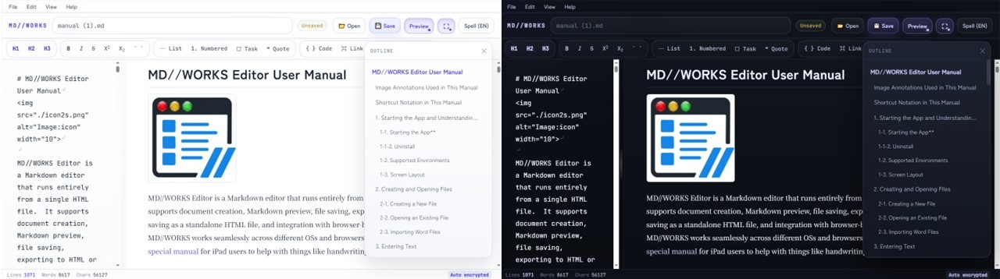

# 🚀 MD//WORKS v1.6.1 — AIアシスタント融合スタンドアロン Markdown エディタ
**Languages:** [🇺🇸 English](README.md) or [🇯🇵 日本語](README-ja.md)

* **完全ローカル、なのにAI対応**  
  MD//WORKSはクラウドに依存しない完全なローカル環境で動作します。データは手元のデバイスに安全に保管したまま、ブラウザ標準のAIサイドバーと連携。面倒なコピペ作業なしで、シームレスにAIを活用できます。もちろん、ローカルLLMもフルサポートされます。

* **Deep Edit Mode—— 思考の軌跡まで、すべて記憶する** 
書いた言葉だけでなく、「消し去った迷いや試行錯誤」まで記憶。5秒ごとのタイピング集計から、大幅な削除、貼り付け、一括置換、見出しごとの書式変更まで、編集の足跡を余すことなく追跡します。画面の片隅で「DEEP」バッジが静かに点灯している間、最大500件の操作を文書とは別に記録。蓄積された履歴をもとに、AIを活用して自分の執筆プロセスを客観的な第三者視点から分析することも可能です(v1.6.1以降対応)。

ブラウザAIを執筆支援ツールとして**積極活用**する方法や、逆にブラウザAIを使用せず**安全性重視で運用**する方法について[取扱説明書の「11. AI支援執筆」](https://github.com/HKJPN/markdown-editor/blob/main/docs/manual-ja.md#11-ai%E6%94%AF%E6%8F%B4%E5%9F%B7%E7%AD%86--)にて解説しています。

# インストール不要で即実行可能

👉 **https://hkjpn.github.io/markdown-editor/**

- [🚀 クイックスタート（はじめに）](docs/quick-start-ja.md)
- [📖 取扱説明書(汎用)](docs/manual-ja.md)
- [📱 iPad向け 取扱説明書](docs/ipad-manual-ja.md)
- [🎓Scientific Writing Guide](docs/scientific-writing-ja.md).
- [🛡️セキュリティとプライバシー](SECURITY.md)

MD//WORKSはMITライセンスの下、ご自身のウェブサイトで自由にホストしてのご利用も可能です。ただし、セキュリティとパフォーマンスの観点から、公開環境は常に最新バージョンに保つことを強く推奨します。

---
## 🎉 v1.6.1の新機能とアップデート

### Deep編集モード

完成した文章だけでなく、途中で消した言葉や迷い、試行錯誤まで、編集の過程を時系列で振り返れます。本文とは別のログとして記録されるため、推敲の流れや自分の思考プロセスを客観的に確認できます。

### File > Openの改良

パスワードで保護したAppsも **File > Open**から直接開けるようになりました。これにより MD//WORKS でサポートされている全ての形式のファイルは**File > Open**メニューから同じように開けるようになりました。もちろん、自己展開ファイルは自己展開形式でも開けることは、いままで通りサポートされています。
  
---

## ✨ 今後のアップデート予定

* **数式のレンダリング (Math Equations)**：数学や工学分野で多用される、複雑な数式の表示に対応する予定です。
* **PWA対応**：お使いの端末にインストールして、ネイティブアプリのようにより高速・快適に利用できるPWA（Progressive Web App）に対応予定です。
 
---

## 💡  便利なコンパニオンツール

大量の画像を瞬時に1つのファイルへとまとめる、2つのコマンドラインツールも提供しています。画像主体のレポートや配布資料を作成する際、MD//WORKSでの作業効率を更に向上させます。

- [images2md.py](https://github.com/HKJPN/images2md/tree/main): 標準的なMarkdownファイルを生成します。

- [images2rhtml.py](https://github.com/HKJPN/images2rhtml/tree/main): 制限付きHTMLファイルを生成します（通常のブラウザ上では印刷やテキストのコピーが無効化されますが、MD//WORKS内ではそのまま完全に編集可能です）。

---

# 機能一覧

## 📝 Word (.docx) インポート

Word 文書を Markdown に直接取り込めます。

- **UI**：**File › Import Word**
- 見出し、段落、リスト、簡単な表を Markdown に変換
- 複雑な表や図形はプレースホルダーとして扱う
- 見た目より **内容の正確さ** を優先

Word 下書き、マニュアル、レポート、議事録などの Markdown 化に最適です。

---

## 📝　安全性と透明性

MD//WORKSは完全オープンソースです。HTMLアプリとしてブラウザ上で動作しますが、ドキュメントの処理はすべてローカルの端末内で完結します。編集・保存・書き出し・暗号化など、すべての処理はブラウザ内で実行され、データが外部サーバーに送信されることはありません。

- インストール不要  
- アカウント登録も不要  
- アクセス解析やトラッキングも一切なし

ぜひコードを確認し、ご自身で確かめてください。もし、問題点や潜在的な脆弱性を発見された場合は、Issuesでご報告ください。必要に応じて、非公開でご連絡いただいても構いません。

**※プライバシーに関して**

* **AIを活用したい場合:** ChromeやBraveなどのブラウザAI（GeminiやLeo）を使用して文章の校正などを行う場合、テキストは各プロバイダのポリシーに従って処理されます。機密情報を扱う際は、AIサイドパネルを閉じるか、読み取り許可をオフにできます。
* **更にプライバシーを確保したい場合:** 各AIアシスタントを禁止できるブラウザをご使用いただくことで、より安全なエディタとして機能します。詳細は[取扱説明書の「11. AI支援執筆」](https://github.com/HKJPN/markdown-editor/blob/main/docs/manual-ja.md#11-ai%E6%94%AF%E6%8F%B4%E5%9F%B7%E7%AD%86--)をご覧ください。

---

## 📦 共有も保護も自由自在。柔軟なエクスポート機能

MD//WORKSの最大の特徴は、用途に合わせて「文書を1つのHTMLファイルとして書き出せる」ことです。情報共有、共同執筆、長期保管など、相手の環境を問わず、最適な形でドキュメントを共有・保護できます。

* 👀 **「読ませる」ための Viewer 形式**（全3種）
アウトライン付きで読みやすい通常版に加え、**無断コピーや印刷を防ぐ「制限付き」**、機密情報を守る「パスワード保護」を用意。プレゼン資料の配布など、安全な情報提示に最適です。
* ✍️ **「続きを書く」ための Standalone App 形式**（全2種）
**作成した文書とエディタ機能を、まるごと1つのファイルにパッケージ化**。ファイルを受け取った相手は、アプリをインストールすることなく、ブラウザを開くだけで即座に編集を再開できます（パスワード保護にも対応）。

>💡 **シチュエーションに応じた使い分け**
>
>提示するだけのハンドアウト資料は「制限付きViewer」でスマートに。相手にも加筆してほしい場合は「Standalone App」として渡すだけ。目的に合わせて出力形式を切り替えられます。

| 形式 | MD//WORKS 再編集 | パスワード 保護 | コピー・印刷 |
| --- | --- | --- | --- |
| Viewer | 🚫不可 | 🔓無 | 🖨️可能 |
| 制限付きViewer | ✔可能 | 閲覧時:🔓不要 復元時:🔐必要 | 🛡️抑制 |
| パスワード付きViewer | ✔可能 | 🔐有 | 🔓🖨️保護解除後に可能 |
| Standalone App | ✔可能 | 🔓無 | 🖨️可能 |
| パスワード付きApp | ✔可能 | 🔐有 | 🔓🖨️保護解除後に可能 |

---

## ✍️ 高機能 Markdown 編集

- GitHub Flavored Markdown 対応
- 見出し、太字、斜体、リスト、タスクリスト、コード、リンク、表、区切り線をワンクリック挿入
- 選択範囲の **タスク一括切り替え**
- 構造化文章向けのモノスペースエディタ
- タスク・検索結果・スペル候補の視覚的ハイライト

---

## 👀 ライブプレビュー

- `marked` によるリアルタイム描画
- `DOMPurify` による安全な出力
- 見出し・表・コード・引用・タスクリストのスタイル適用
- エディタとプレビューのスクロール同期
- 分割ビューの調整可能

---

## 🧭 アウトラインナビゲーション

- **UI**：**View › Outline**
- `#`〜`####` の見出しに対応
- 任意のセクションへ即ジャンプ
- 編集に合わせて自動更新

---

## 🛟 編集履歴と復元

- **UI**：**File › History (Recent Files)**
- 最大 10 件の文書状態を保存
- 開いたファイル・保存したファイル・終了前の状態を記録
- 履歴から過去バージョンを復元
- 自動保存と復元プロンプトでデータ損失を防止

---

## 🧹 Markdown フォーマッタ

- **UI**：**Edit › Format Markdown**
- 空行の整理
- 見出し記号後のスペース追加
- 不要な末尾スペース削除
- 正しい Markdown 改行は保持

---

## 🔍 高機能検索・置換

- 検索・置換
- すべて置換
- 正規表現対応
- 大文字小文字の区別
- 単語単位の一致
- カーソル位置から最も近い一致へ自動ジャンプ

---

## 🔤 英語スペルチェック

- インラインのスペル候補表示
- コード・リンク・Markdown 記法は可能な限り無視
- カスタム辞書対応
- 波線による視覚的ハイライト

---

## 🧘 Zen モード

- **UI**：**View › Zen Mode**
- メニュー・ツールバー・ステータスバー・プレビューを非表示
- エディタを中央に配置
- `Esc` で即終了

---

## 📤　印刷とPDF出力

- 印刷向けに最適化したCSSによる安定した出力に対応しています。

---

## 🌍 多言語対応

- ブラウザ言語を自動検出
- 日本語 Shift_JIS読み込み対応
- 英語 UI / 日本語 UI
- アップデート後のリリースノート自動表示

---

## 💻 対応環境

- **ブラウザ:** 全てのモダンブラウザで動作可能 (Chrome, Edge, Brave, Firefox, Safari, etc.)。
- **インストール不要:** HTMLファイルを開き、すぐに書き始めることが可能です。
- **全ディバイス対応:** デスクトップ環境はもちろん、iPad等のタブレットでも動作確認を行っています。

---

## 🔒 安全性と信頼性

- 自動保存と復元プロンプト
- 未保存変更の警告
- Content Security Policy 対応
- プレビューの安全なサニタイズ
- スタンドアロンファイルは独立したローカルストレージを使用

---

## 🧭 他のエディタとの違い

**MD//WORKSは、IDE、ナレッジベース、共同編集ツールを置き換えることを目的にしたものではありません。**  
MD//WORKSが目指しているのは、もっと別の領域です。  
書くこと、保護すること、復元すること、そして作品を手軽に持ち運ぶことに特化した、軽量でポータブルなMarkdownエディタです。

| 機能 | VS Code | Obsidian | Typora | MD//WORKS |
|---|---:|---:|---:|---:|
| エディタと文書を1つにまとめる | ❌ | ❌ | ❌ | ✅ |
| **Viewerモードで 編集・印刷・コピー抑制** | ❌ | ❌  | ❌ | ✅ |
| **暗号化されたファイルとして書き出し** | ❌ | ❌ | ❌ | ✅ |
| 下書き復元・執筆中の安全性 | △ | △ | ❌ | ✅ |
| **AI 支援執筆** | △ (拡張機能必須) | △  (プラグイン必須) | ❌  (コピペのみ) | ✅  (標準対応※) |
| オフライン・制限環境での使いやすさ | △ | ○ | ○ | ✅ |
| プラグイン / 拡張機能の豊富さ | ✅✅✅ | ✅✅ | △ | ❌ |

>※ **AI支援執筆**：ブラウザ標準のAIサイドバーと連携。コピー＆ペースト不要で、選択範囲や文書全体をAIと共有可能。ブラウザの設定により、AI共有禁止も可能。

MD//WORKSの特徴

VS Code、Obsidian、Typoraはいずれも優れたツールですが、それぞれ前提としている用途が異なります。

- **VS Code** は、強力な開発環境です。
- **Obsidian** は、知識をつなげて管理するナレッジベースです。
- **Typora** は、完成度の高いMarkdown執筆アプリです。
- **MD//WORKS** は、別の考え方で設計されています。  
  **標準でAI支援執筆**も可能で書いたものを、**保護**し、環境ごと1つのファイルとして**持ち運べる**Markdownエディタです。

**Export as App** と **Private App export** により、MD//WORKSはMarkdown文書を、持ち運び可能なHTMLアプリとして書き出せます。  
目的は機能をむやみに増やすことではなく、執筆により集中し、文書を簡単に移動・再編集・保護できるようにすることです。

---

## 🚫 MD//WORKS が目指していないもの

- プラグインプラットフォーム
- ナレッジグラフ
- コード IDE
- クラウド共同編集
- 本格的な出版・レイアウトソフト

MD//WORKS は、軽量・ポータブル・安全な「日常的に書くためのツール」であることを重視しています。

---

## ✅ MD//WORKS が向いているユーザー

- 論文・技術文書・マニュアル・原稿を書く人
- 仕様書・RFC・リリースノート・設計文書を書くエンジニア
- Word 下書きを Markdown に変換したい研究者・ビジネスユーザー
- ポータビリティ・オフライン・復元性を重視する人
- インストールやクラウド利用が難しい環境で作業する人

---

## ⚠️ 他ツールのほうが向いている場合

- プラグインによる高度なカスタマイズ
- 大規模ナレッジベース
- バックリンクや知識管理
- IDE 的な開発ワークフロー
- リアルタイム共同編集
- 高度なレイアウト・出版機能

---

## 📄 ライセンス
**MIT License**
