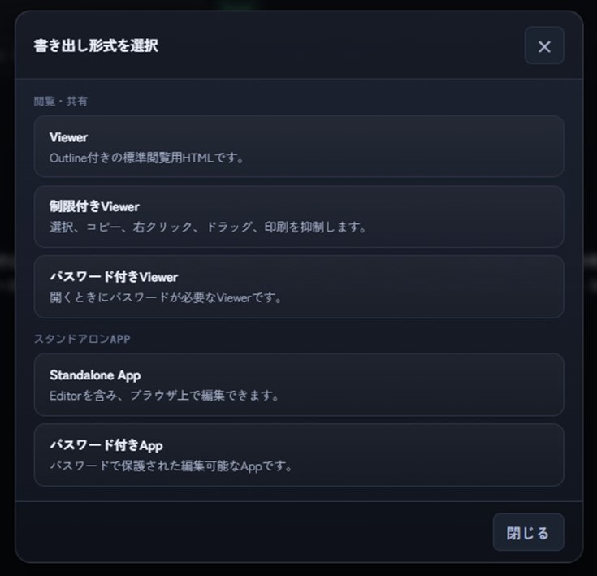
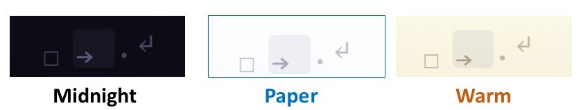

# MD//WORKS Editor 取扱説明書

MD//WORKS Editor は、1つのHTMLファイルで動作するMarkdownエディタです。  
文書の作成、Markdownのプレビュー表示、ファイル保存、HTML/PDF書き出し、スタンドアロンHTMLとしての保存、ブラウザAIに対応しています。MD//WORKSは各OSやブラウザにそれぞれ対応するよう設計されていますが、iPadは手書きやAI対応を含め[専用の説明書](https://github.com/HKJPN/markdown-editor/blob/main/docs/ipad-manual-ja.md)をご用意しました。

## 本書の画像注釈について

本書では、画面内の操作箇所を枠線や番号で示します。  
赤枠はクリック・選択する場所、青枠は確認する表示、丸数字は操作順を表します。

## ショートカット表記について

本書では、Windows / Linux 向けのショートカットを **Ctrl**、Mac向けのショートカットを **⌘** で併記します。  
例：**Ctrl+S / ⌘S**

Shiftキーを含むショートカットは、Mac側では **⇧** を使って表記します。  
例：**Ctrl+Shift+S / ⌘⇧S**

ブラウザやOSの仕様により、ショートカットがブラウザ標準操作と競合する場合があります。その場合は、メニューバーから操作してください。

---

## 1. 起動と画面構成

### 1-1. 起動する

MD//WORKS はインストールは不要で、Editor のHTMLファイルをブラウザで開くとそのまま利用できます。[MD//WORKS Editorのサイト](<https://hkjpn.github.io/markdown-editor/>)から直接起動も可能です。前回の未保存データが残っている場合は、復元確認が表示されることがあります。復元する場合は確認画面で復元を選択してください。

インストールは不要ですが、次の手順でアプリ化することも可能で、アプリ化した後も必要に応じてブラウザと行き来することができます。

#### 1-1-1. アプリ化の手順とブラウザタブとの行き来（Chromeの場合）
他のブラウザをお使いの場合は[5：各種ブラウザでのアプリ化とアンインストール法](#appendix-5-other-browsers)をご覧ください。


1. PC/MacのChromeブラウザで [MD//WORKS Editorのサイト](<https://hkjpn.github.io/markdown-editor/>) を開きます。
2. 画面右上のメニュー（︙）＞「キャスト、保存、共有」＞「ページをアプリとしてインストール」を選択してください。
3. 確認画面で「インストール」をクリックすると、デスクトップやタスクバーにMD//WORKSの専用アイコンが作成されます。
4. このアイコンをクリックするだけで、独立したウィンドウとしてすぐに起動し編集を開始できます。
5. ブラウザAIを利用する場合等、 画面右上のメニュー（︙）から**「Chromeで開く」** を選択します。編集中のテキストを保持したまま通常のブラウザタブに移動します。
6. 再び執筆に集中するアプリモードに戻る時はブラウザのアドレスバー右端に表示される **「アプリで開く」** ボタンをクリックします。
<br>

> 💡**HTMLファイルをダウンロードしてローカルでご使用の場合**:アドレスバーにインストールボタンは表示されません。Chromeのメニュー（︙）の「保存して共有」＞「ショートカットを作成」から、「ウィンドウとして開く」にチェックを入れて作成してください。

#### 1-1-2. アンインストール（Chromeの場合）

　MD//WORKS EditorのHTMLファイルからの実行又は[MD//WORKS Editorのサイト](<https://hkjpn.github.io/markdown-editor/>)から実行の場合はアンインストールは必要ありません。MD//WORKSのHTMLファイルをキャッシュも含め削除することで完全に消去できます。ChromeのAppとしてイントールした場合は、 独立したアプリウィンドウを起動し、画面右上のメニュー（︙）から **「MD//WORKS をアンインストール」** を選択してください。※削除できない場合は、4の「アンインストール」をご覧ください。

### 1-2. 対応環境の目安

MD//WORKSは、最新ブラウザが動作するほぼすべての環境に対応しています。保存挙動のOSとブラウザによる違いは[こちら](#save-behavior)をご覧ください。

* **端末要件:** 最新ブラウザが動作するPC(Windows/Linux)、Mac、iPad、Androidタブレット、およびChromebook等。
* **画面サイズ:** タブレットサイズ以上が必要です。iPhoneやAndroidスマートフォンにおいても、横画面表示や外部ディスプレイを使うことで、ほぼすべての機能をご利用いただけます。

> 💡 **複数タブでの同時編集について**
> v1.6.3以降では、同じブラウザ内で複数のタブを開き、それぞれ別の原稿を編集できます。各タブは独立したWorkspaceとして扱われ、Auto Saveの本文とファイル名、作業履歴もタブごとに分離されるため、複数文書を並行して編集する際の相互上書きを防ぐ設計になっています。ブラウザのタブには現在のファイル名が表示され、未保存の変更がある場合は先頭に`●`が表示されます。
>
> 対応環境でブラウザの「タブを複製」を使用した場合も、複製したタブは別のWorkspaceとして自動的に分離されます。複製元までの作業履歴は引き継がれますが、その後の履歴は各タブで独立して記録されます。Midnight、Paper、Warmなどのテーマをブラウザや用途ごとに使い分ける方法も、複数の作業環境を視覚的に区別する方法として引き続き便利です。

### 1-3. 画面構成


* **① メニューバー**  
  ファイル、編集、表示、ヘルプ、及び最新バージョン通知の各メニューへアクセスします。ファイルの新規作成、保存、書き出し、表示切替、ヘルプ確認などを行います。

* **② タイトルバー**  
  アプリ名、ファイル名、保存状態、主要な操作ボタンが表示されます。  
  ファイルを開く、保存する、Previewを切り替える、全画面表示にする、Spell (EN) を使うなどの操作をすばやく行えます。

* **③ ツールバー**  
  見出し、太字、斜体、取り消し、上付き、下付き、リスト、番号、タスク、引用、コード、リンク、表などをワンクリックで挿入できます。  
  Markdownに慣れていない場合でも、基本的な書式を簡単に入力できます。

* **④ エディター画面**  
  Markdown形式で本文を入力するメインエリアです。  
  テキストの編集、見出し作成、リスト作成、画像の挿入などを行います。

* **⑤ プレビュー画面**  
  入力したMarkdownを整形して表示する画面です。  
  実際の見た目を確認しながら編集できます。プレビューは、タイトルバーの **Preview** ボタンまたは **表示 > Preview** から切り替えできます。

* **⑥ ステータスバー**  
  現在の行数、単語数、文字数、Spell (EN) の状態、ストレージ保護モードが表示されます。  
  ストレージ保護モードには、通常の **Auto encrypted** と、パスフレーズを使う **Private Storage** があります。

---

## 2. ファイルを作成・開く


### 2-1. 新規作成する

新しいMarkdown文書を作成するには、メニューバーの **ファイル > 新規作成（Ctrl+N / ⌘N）** を選択します。

作業中の内容がある場合は、必要に応じて保存してから新規作成してください。  
新規作成時には、現在の内容を履歴に保存してから新しい文書を作成する確認が表示されることがあります。

### 2-2. 既存のファイルを開く

PCに保存されているMarkdownファイル（`.md`、`.txt`、`.markdown` など）の続きを編集するには、メニューバーの **ファイル > 開く（Ctrl+O / ⌘O）**、またはタイトルバーの **開く** ボタンをクリックします。

`.html` / `.htm` ファイルもテキストソースとして開いて編集できます。MD//WORKSが書き出したRestricted Viewer、Private Viewer、Password-protected Appなどの対応HTML形式を開いた場合は、その形式を判定して必要な復元処理を行います。Markdownやテキストファイル内にこれらのHTMLコード例が含まれていても、特殊形式として扱われることはありません。

### 2-3. Wordファイルを読み込む

お手持ちのWordファイル（`.docx`）を読み込んで、Markdownに変換して編集を開始できます。  
メニューバーの **ファイル > Wordファイルを開く (.docx)** を選択し、ファイルを選ぶと自動的に変換されます。

ファイルサイズの上限は **10MB** です。

> **注意:** Wordファイルの読み込みは、本文構造をMarkdownに変換するための機能です。Word上の細かなレイアウト、フォント、余白、図表、脚注、複雑な表などは、完全には再現されない場合があります。読み込み後は、Preview画面で内容を確認してください。

> **注意:** Wordファイルを読み込むと、現在の編集内容を置き換える確認が表示されます。必要な内容は、事前に **ファイル > 保存（Ctrl+S / ⌘S）** で保存してください。

---

## 3. 本文を入力する


本文は、画面中央または左側の **エディター画面** に入力します。  
MD//WORKS Editorでは、Markdown形式で文章を作成できます。

### 3-1. 基本的な入力例

```markdown
# 見出し1

これは本文です。

## 見出し2

- 箇条書き
- 箇条書き

**太字** や *斜体* も使えます。
```

### 3-2. 画像を挿入する


小さなローカル画像は、エディター画面へドラッグ＆ドロップして挿入できます。

画像を挿入すると、Markdown内に画像データとして追加されます。  
ただし、ローカル保存容量を圧迫しないよう、挿入できる画像サイズには制限があります。

対応の目安は次のとおりです。

| 項目 | 内容 |
| --- | --- |
| 画像サイズ |300KB以下 |
| 対応画像 | PNG、JPEG、WebPなど |
| 非対応画像 | SVG画像 |

SVG画像は安全性のため挿入できません。必要に応じてPNG、JPEG、WebPなどに変換してから挿入してください。

>多数の画像を取り込むために[image2md.py](https://github.com/HKJPN/images2md/tree/main)と[images2rhtml.py](https://github.com/HKJPN/images2rhtml/tree/main)を別途のコマンドラインツールとしてご用意しました。レポートやプレゼンテーションの配布資料作成など、多数の写真を一度に取り込む際にこれらコマンドラインツールも併用ください。

| ツール               | 出力                     | 向いている用途                              |
| ----------------- | ---------------------- | ------------------------------------ |
| MD//WORKS         | Markdown／Viewer<br> Restricted Viewer HTML／Standalone App.等      | 少数の画像をまとめた後に、関連する脚注文等の編集を行って、あとからパスワード保護等も自由に選択して行いたい　  |    
| `images2md.py`    | Markdown               | 多数の画像をまとめた後、文章、動画、PDF、議事録などを追加して編集したい   |
| `images2rHTML.py` | Restricted Viewer HTML | 多数の画像資料をまとめてすぐに配布し、一般的なコピー、印刷、意図しない改変を抑制したい。更にあとから詳細編集行いたい |

💡 **ヒント:** `images2md.py` や `images2rHTML.py` といったツールを使用すると、300KBの画像制限を回避できます。ただし、動作の安定性を保つため、MD//WORKSへ再読み込みする際のファイル合計サイズは**20MB以内**に収めるようご注意ください。

### 3-3. 画像などのローカルファイル

MD//WORKS Editorでは、画像、動画、音声、PDFなどのローカルファイルを「相対パス」で指定してプレビュー画面に表示・再生させることができます。画像はBase64での埋め込みも可能です。ここでは、相対リンクとして表示する方法と画像を埋め込む方法について解説しています。

> ⚠️注意：iPadOSなどのモバイルOS環境では、OSの厳格なセキュリティ制限により、ローカル環境での相対リンクは機能しません。直接埋め込み方式をご利用ください


#### 3-3-1. ローカルフォルダからアプリを開く場合

MD//WORKSのHTMLファイル、Markdownファイル、および関連するメディアファイルを同じフォルダ構成内に配置することで、正常に相対リンクが機能します。

**【フォルダ構成の例】**

```text
project/
├─ index.html (アプリ本体)
├─ manual.md
├─ images/
│  └─ figure01.png
├─ videos/
│  └─ demonstration.mp4
└─ audio/
   └─ explanation.mp3

```

**【Markdownでの記述例】**

```markdown


[動画を開く](videos/demonstration.mp4)

[音声を開く](audio/explanation.mp3)

<video controls src="videos/demonstration.mp4"></video>

```

この構成にすることで、Google ChromeおよびFirefoxのどちらの環境でも、画像の表示、ファイルリンクの遷移、対応動画のプレビュー画面内でのインライン再生がスムーズに行えます。

> 💡 *大量のローカルのメディア（画像・動画・音声・PDF）を活用したいとき*
> 
> この構成はメディアファイルの数が多い場合やファイルサイズが大きい場合に、MD//WORKSの動作が軽快となりおすすめです。

#### 3-3-2. Web上のMD//WORKSからローカルファイルを開く場合

ウェブサイト上で公開されているWeb版のMD//WORKSを開き、そこからパソコン内のMarkdownファイルを選択して編集する場合、同じフォルダにある画像等は自動的には読み込まれません。これはブラウザのセキュリティ仕様による共通の挙動であり、アプリの不具合ではありません。
> 💡 *少数の画像やサイズの小さな画像の場合（合計数十MB程度まで)*
> 
>フォルダからの画像の自動読み込みができなくても「3-2. 画像を挿入する」を参考に、Markdownへ直接埋め込む（ドラッグ＆ドロップする）ことができます。作成したMarkdownファイルの画像はどの環境でも安定してインライン表示できるので、互換性を重視する場合にはおすすめです。


### 3-4. 入力状況を確認する

入力中の行数、単語数、文字数は画面下部のステータスバーに表示されます。


---


## 4. 文章を装飾する


文章の装飾は、Markdown記法を直接入力する方法と、ツールバーを使う方法があります。

ツールバーを使うと、Markdown記法を覚えていなくても、見出し、太字、リスト、引用、コード、リンク、表などを簡単に挿入できます。

> 💡 **ツールバー操作時のカーソル保持**
> ツールバーからH1 / H2 / H3の見出し、引用、水平線などを挿入しても、元の本文に対するカーソル位置やテキストの選択範囲は維持されます。タッチ操作や外付けキーボードを併用する場合も、ボタン操作の後にそのまま入力や編集を続けられます。

### 4-1. 見出しを作る


見出しを作るには、ツールバーの **H1 / H2 / H3** ボタンを使用します。

| ボタン | 内容 | Markdown例 |
| --- | --- | --- |
| H1 | 大見出し | `# 見出し` |
| H2 | 中見出し | `## 見出し` |
| H3 | 小見出し | `### 見出し` |

### 4-2. 太字・斜体・取り消し線を付ける


文字を選択してから、ツールバーのボタンを押すと、選択した文字に装飾を付けられます。

| ボタン | 内容 | Markdown例 |
| --- | --- | --- |
| B | 太字 | `**太字**` |
| I | 斜体 | `*斜体*` |
| S | 取り消し線 | `~~取り消し線~~` |

インラインコードは、文字の前後をバッククォートで囲みます。

例：<code>`コード`</code>

### 4-3. リスト・タスク・引用を作る

箇条書きやタスク管理用のチェックリストも作成できます。1行又は複数行を同時選択し、ツールバーのリスト、番号、タスクのボタンを押すことでも設定可能です。複数回押すことで再設定や解除が可能です。

```markdown
- 箇条書き
- 箇条書き

1. 番号付きリスト
2. 番号付きリスト

- [ ] 未完了タスク
- [x] 完了タスク

> 引用文
```

### 4-4. コード・リンク・表を挿入する


技術メモや仕様書を作成する場合は、コードブロックや表も便利です。エディター画面にペーストした後に、プレビュー画面で確認してみましょう。


```markdown
| 項目 | 内容 |
|---|---|
| ファイル形式 | Markdown |
| 保存形式 | .md |
```
### 4-5. 上付き文字・下付き文字

生命科学、化学、物理学などのドキュメントでは、化学式、電荷、単位、指数を表すために、下付き文字や上付き文字が頻繁に使われます。エディター画面にペーストした後に、プレビュー画面で確認してみましょう。


```markdown
H<sub>2</sub>O, CO<sub>2</sub>, A<sub>260</sub>/A<sub>280</sub>
H~2~O, CO~2~, A~260~/A~280~

Ca<sup>2+</sup>, 10<sup>6</sup> cells, cm<sup>2</sup>
Ca^2+^, 10^6^ cells, cm^2^
```

Pandoc-compatible syntax である`~` や `^` を用いる表記法にも対応しました。他の多くの環境でも互換性を保ったまま表示したい場合は、HTMLタグを使う方法がおすすめです。


### 4-6. 脚注を挿入する

本文に注釈や参考文献などを追加できます。科学報告での脚注の記載方法詳細は、別途[Guide to Markdown for Scientific Writing](<https://github.com/HKJPN/markdown-editor/blob/main/docs/scientific-writing-ja.md>)をご覧ください。

 * **本文中の書き方:** 脚注を入れたい場所に `[^note]` や `[^1]` のように記述します（ラベルには半角英数字やハイフンが使えます）。
 * **脚注内容の書き方:** 文書の任意の場所（推奨は末尾）に `[^note]: ここに脚注の内容を書きます` と記述します。
 
> **💡 表示について**<br>
 プレビュー画面やViewerとして書き出したファイルでは、ラベル名に関わらず本文中の出現順に自動で「1, 2...」と連番が振られます。また、ページ下部に脚注一覧としてまとめられ、クリックで相互に移動できるリンクが生成されます。

### 4-7. 数式を挿入する


[LaTeX記法](<BasicExamplesMathFormulasJ.md>)を使用して、数学、物理学、化学などで用いる数式を挿入できます。入力した数式は、Preview画面で見やすく整形して表示されます。

* **インライン表示:** 文中に数式を挿入する場合は、数式を半角の `$` で囲みます。

  入力例：

```markdown
  質量とエネルギーの等価性は $E=mc^2$ で表されます。
```


* **ブロック表示:** 数式を独立した段落として表示する場合は、数式の前後を `$$` で囲みます。`$$` はそれぞれ別の行に記述してください。

  入力例：

  ```markdown
  $$
  x = \frac{-b \pm \sqrt{b^2 - 4ac}}{2a}
  $$
  ```

> **注意:** すべてのLaTeXコマンドや追加パッケージに対応しているわけではありません。数式を入力した後は、Preview画面で表示結果を確認してください。

> **オフライン時の表示:** 数式描画ライブラリを読み込めない場合も、本文のPreviewは表示され、数式部分はLaTeX記法のまま表示されます。オンラインに復帰してライブラリの取得に成功すると、表示中の数式は自動的に整形表示へ切り替わります。


---

## 5. プレビューで確認する

Preview機能を使用すると、エディタに入力したMarkdownが、実際にどのように表示されるかを確認できます。見出しや太字などの基本的な記法だけでなく、表、脚注、上付き・下付き文字、数式など、構造が複雑になりやすい要素もPreviewで確認することで、記法の誤りや表示の崩れに気づきやすくなります。


### 5-1. Previewを表示する

Previewは次のいずれかをタップするたびに、「編集画面とPreviewの分割表示」→「Focus Preview」→「編集画面のみ」と遷移します。

* タイトルバーの **Preview** ボタン
* メニューバーの **表示 > Preview**


#### 5-1-1. 編集画面とPreviewの分割表示

画面の左側にMarkdownの編集画面、右側にPreviewが表示されます。

左側の文章を編集すると、その内容が右側のPreviewへ反映されるため、表示結果を確認しながら執筆できます。表、脚注、画像などを調整するときに便利です。編集画面とPreviewの境界は、中央の仕切りをドラッグして位置を調整できます。

#### 5-1-2. Focus Preview

Previewを大きく表示し、文書の閲覧に集中できる表示モードです。アウトラインを表示して見出しを選択すると、目的のセクションへすばやく移動できます。文書全体の確認、校正、読み合わせ、簡単なプレゼンテーションなどに利用できます。

Focus Previewから編集画面へ戻るには、次のいずれかを使用します。

* タイトルバーまたはメニューバーの **Preview** をもう一度選択する
* 画面上の **編集画面へ戻る** ボタンを選択する

### 5-2. Preview画面で確認できる内容

Previewでは、主に次の要素を確認できます。

* 見出し
* 太字、斜体、取り消し線
* 上付き文字、下付き文字
* 数式（LaTeX記法によるインライン表示・ブロック表示）
* 箇条書き、番号付きリスト
* チェックリスト
* 表
* 引用
* 脚注
* インラインコード、コードブロック
* リンク
* 画像


---

## 6. ファイルを保存する


作成した文書は、Markdownファイルとして保存できます。

### 6-1. Markdownファイルとして保存する

1. タイトルバーの **保存** ボタンをクリックします。  
   または、メニューバーの **ファイル > 保存（Ctrl+S / ⌘S）** を選択します。
2. 必要に応じて保存先を選択します。
3. Markdownファイルとして保存されます。

同じ操作はショートカットでも実行できます。  
名前を付けて保存する場合は、**ファイル > 名前を付けて保存（Ctrl+Shift+S / ⌘⇧S）** を使用します。

### 6-2. ファイル名を変更する


タイトルバーのファイル名欄をクリックすると、ファイル名を変更できます。  
たとえば、`untitled.md` を `meeting-note.md` や `manual-draft.md` のように変更できます。

### 6-3. 保存状態を確認する


タイトルバーには、現在の保存状態が表示されます。

| 表示 | 意味 |
| --- | --- |
| Unsaved | 未保存の変更あり |
| Saved | 保存済み |


編集後に保存していない内容がある場合は、保存状態が変化します。  
作業を終える前に、保存状態を確認してください。

### 6-4. ローカル下書きの保護を理解する

MD//WORKS Editorでは、下書きや履歴などのローカル保存データを平文のまま保存しないよう、**Auto encrypted** による保護が行われます。  
さらに保護を強めたい場合や、データを完全に消去したい場合は以下の機能を利用できます。

* **Private Storage**：自分だけのパスフレーズを設定し、ブラウザ内の下書き・履歴を追加保護します。
* **ローカル保存データ削除**：ファイルメニューの **Storage Security** 内にあり、ブラウザに保存された保護下書きや履歴を完全に消去します。

> **重要:** Auto encrypted や Private Storage は、ブラウザ内の下書き・履歴を保護する機能です。正式なファイル保存の代わりではありません。作業を確実に残すには、必ず **ファイル > 保存（Ctrl+S / ⌘S）** で `.md` ファイルとして保存してください。

### 6-5. Private Storage と 暗号化Appの違い

**Private Storage** と **暗号化Appとして保存** は、どちらもパスフレーズを利用できますが、目的が異なります。

| 機能 | 目的 | 保護対象 |
| --- | --- | --- |
| Private Storage | 現在使っているブラウザ内の下書き・履歴を保護する | ブラウザ内のローカル保存データ |
| 暗号化Appとして保存 | 現在の原稿をパスフレーズ付きHTMLファイルとして書き出す | 書き出したHTMLファイル |

どちらもパスフレーズを忘れると復元できません。重要な原稿は、Markdownファイル（`.md`）としても別途保存してください（パスワード管理の詳細は「13-18. 暗号化されたファイルの長期的なアクセスと互換性について」を参照）。

### 6-6. 作業履歴から復元する


**ファイル > 作業履歴** を選択すると、保存された下書き履歴を確認できます。  
誤って内容を消してしまった場合や、以前の下書きに戻したい場合に使用します。

複数タブで編集している場合、作業履歴は現在のタブのWorkspaceごとに独立して管理されます。保存後の履歴には、保存時に確定した実際のファイル名が表示されます。

ただし、**ローカル保存データ削除** を実行すると、履歴も削除されます。  
大切な文書は、履歴だけに頼らず、Markdownファイルとして保存してください。

<a id="save-behavior"></a>
### 6-7. OS・ブラウザ別 ファイル保存・上書きの挙動

MD//WORKS Editor は、Windows、macOS、iPadOS、Android、ChromeOS、Linux など、さまざまな環境で利用できます。 ご利用の端末（OS）とブラウザの組み合わせにより、ファイルの保存および「上書き保存（ダウンロード）」の挙動が異なります。

| OS / プラットフォーム | Chrome / <br>Edge   | Brave  | Firefox     | Safari     |
| ------------------- | ----------------------------------------------------------------------------------------------------------- | --------------------------------------------------------------------------------- | ----------------------------------------------------------------------------------------- | -------------------------- |
| **Windows / Linux** | 初回保存以降、**直接上書き**が可能。                                                         | 任意のフォルダに「名前を付けてDL」で**手動で上書き可能**。 | 直接上書き不可。<br>**番号付きのサフィックス**を付けた新しいファイルとしてダウンロードされます。 | —                          |
| **macOS**           | 初回保存以降、**直接上書き**が可能。                                                         |  任意のフォルダに「名前を付けてDL」で**手動で上書き可能**。 | 直接上書き不可。<br>**番号付きのサフィックス**を付けた新しいファイルとしてダウンロードされます。 | **Firefox** と同じ。       |
| **iPadOS**          | 直接上書き不可。**Files アプリ**経由で、**任意のフォルダ**に番号付きサフィックスを付けた新しいファイルとして保存されます。 | **Chrome / Edge** と同じ。                                                        | **Chrome / Edge** と同じ。                                                                        | **Chrome / Edge** と同じ。       |
| **Chromebook**      | 初回保存以降、**直接上書き**が可能。                                                         |  任意のフォルダに「名前を付けてDL」で**手動で上書き可能**。 | 直接上書き不可。<br>**番号付きのサフィックス**を付けた新しいファイルとしてダウンロードされます。 | —                          |
| **Android Tablet**  | 🚫 `.md` のダウンロードはサポートされていません。代わりに `.txt` 拡張子を使用してください。                                     | 直接上書き不可。**番号付きのサフィックス**を付けた新しいファイルとしてダウンロードされます。 | **Brave** と同じ。                                                                        | —      
> ** Firefox / Safari / モバイル端末をご利用の方へ**
> ブラウザのセキュリティ仕様により、ローカルファイルへの直接の上書き保存ができません。保存ボタンを押すたびに「履歴管理番号付きダウンロード（例: filename(1).md）」されます。これにより同じファイル名の保存履歴をたどれます。

 
---

## 7. HTML・PDFに書き出す


MD//WORKS Editorでは、Markdownファイルとして保存するだけでなく、用途に応じて複数の形式で書き出しできます。

### 7-1. 柔軟なエクスポート（出力）機能による文書の共有と保護

MD//WORKSは、用途に応じて作成した文書を単一のHTMLファイルとしてエクスポート（書き出し）する機能を備えています。受信側のシステム環境に依存することなく、情報共有、共同執筆、長期保管など、目的に適した形式でドキュメントの共有および保護が可能です。

エクスポート形式は、用途に合わせて以下の2つのカテゴリから選択できます。

**1. 閲覧専用形式（Viewer形式：全3種）**
文書の閲覧に特化した形式です。プレゼンテーション資料の配布など、安全な情報開示に適しています。

* **通常版:** アウトライン（目次）機能が付属した、視認性の高い形式です。
* **制限付き:** テキストの無断コピーおよび印刷操作を制限します。
* **パスワード保護:** 機密情報保護のため、閲覧時にパスワードの入力を要求します。

**2. 編集可能形式（Standalone App形式：全2種）**
作成した文書データと本アプリケーションのエディタ機能を、単一のファイルにパッケージ化して出力する形式です。
ファイルを受領したユーザーは、専用アプリケーションをインストールすることなく、ウェブブラウザを開くだけで即座に編集作業を再開できます。この形式でも、パスワード保護付きの出力を選択することが可能です。

**■ 運用ごとの出力形式の選択例**

* **提示のみを目的とする場合:** 配布用ハンドアウト資料などには「制限付きViewer形式」を推奨します。
* **受信者に加筆を依頼する場合:** 共同執筆など、相手に編集を求める用途には「Standalone App形式」をご利用ください。




| 形式 | MD//WORKS<br>再編集 | パスワード<br>保護 | コピー・印刷 |
| --- | --- | --- | --- |
| Viewer | 🚫不可 | 🔓無 | 🖨️可能 |
| 制限付き<br>Viewer | ✔可能 | 閲覧時:🔓不要<br>復元時:🔐必要 | 🛡️抑制 |
| パスワード付き<br>Viewer | ✔可能 | 🔐有 | 🔓🖨️<br>保護解除後に<br>可能 |
| Standalone <br>App | ✔可能 | 🔓無 | 🖨️可能 |
| パスワード付き<br>App | ✔可能 | 🔐有 | 🔓🖨️<br>保護解除後に<br>可能 |

<br clear="all">

> 💡 **制限付きViewerのパスワードについて**
> 制限付きViewerは、ファイルを開いて閲覧するだけならパスワードは不要です。ここで設定するパスワードは、MD//WORKS上で元のMarkdownを**復元**（再編集用データとして取り出す）する場合にのみ使用します。

> 長期保存する重要文書の保管方法（元のMarkdownファイル、パスワード、使用したMD//WORKSのバージョンのHTMLファイルの保管など）については、「13-18. 暗号化されたファイルの長期的なアクセスと互換性について」にまとめています。

### 7-2. 印刷 / PDF保存

**ファイル > 印刷 / PDF保存...** を選択すると、MD//WORKSの印刷 / PDF保存メニューが開きます。 ここから、プレビュー形式での印刷、Markdownソースの印刷、行番号付きMarkdownソースの印刷を選択できます。


ブラウザの印刷ダイアログで保存先を「PDFに保存」に設定すると、PDFファイルとして出力できます。 また、ブラウザの印刷設定で「ヘッダーとフッター」をオフにすると、URL、日時、ページ番号などのブラウザ情報を含めず、よりプレーンな形で印刷できます。提出用PDFを作成する場合は、出力後に必ずPDFを開いて、見出し、表、画像、改ページを含めて確認してください。

- **プレビュー**  
  MarkdownをHTMLとして整形した表示を、書式を保ったまま印刷できます。

- **Markdownソース**  
  Markdown記法をそのままテキストとして印刷できます。HTMLソースやコードを印刷する場合にも、この形式を使用してください。

- **Markdownソース ☑ 行番号を含める**  
  Markdownソースに論理行番号を付けて印刷できます。論文、特許明細書、コード、長文レビューなどで、行単位の確認や指示を行う場合に便利です。

> 印刷・PDF保存を行う場合は、ブラウザ標準の Ctrl+P ではなく、MD//WORKSの **ファイル > 印刷 / PDF保存...** を使用してください。Ctrl+Pはブラウザが現在の画面を直接印刷するため、アプリUIが含まれたり、ページ分割が崩れたりする場合があります。
> `.html` / `.htm` ファイルやHTMLソースを開いている場合、プレビュー印刷ではHTMLとして解釈され、表示が崩れることがあります。HTMLソースやコードを印刷する場合は、**Markdownソース** または **Markdownソース ☑ 行番号を含める** を使用してください。


---

## 8. 検索・置換・仕上げをする


MD//WORKS Editorでは、文書内の文字列を検索したり、特定の語句をまとめて置換する機能に加え、目次を作成する機能等が搭載されています。長い原稿、議事録、仕様書、研究メモなどを編集する場合に便利です。

### 8-1. 検索する


文書内の文字列を検索するには、メニューバーの **編集 > 検索（Ctrl+F / ⌘F）** を選択します。

#### 操作手順

1. メニューバーの **編集** をクリックします。
2. **検索** を選択します。
3. 検索欄に探したい文字を入力します。
4. 一致した文字列がエディター画面上でハイライト表示されます。
5. **↑ / ↓** ボタンで前後の検索結果へ移動できます。
6. **検索パネルを閉じる:** `Esc`キーまたはパネル右上の×を使用すると、検索パネルだけが閉じ、一致箇所のハイライトはそのまま残ります。
7. **検索ハイライトを解除する:** 検索パネルが閉じた状態で`Esc`キーをもう一度押すと、検索ハイライトを消去できます。検索文字列と検索オプションは保持されるため、再度パネルを開くと同じ条件で検索を再開できます。文書を編集した場合も、残っているハイライトは現在の内容へ追随します。


### 8-2. 置換する


文字列を別の文字列に置き換えるには、**編集 > 置換（Ctrl+H / ⌘H）** を選択します。

#### 操作手順

1. **編集 > 置換** を選択します。
2. 上段に検索したい文字を入力します。
3. 下段に置き換えたい文字を入力します。
4. 1件ずつ置き換える場合は **置換** をクリックします。
5. すべてまとめて置き換える場合は **すべて置換** をクリックします。


### 8-3. 検索オプションを使う


検索・置換パネルでは、次の検索オプションを使用できます。

| 項目 | 内容 |
| --- | --- |
| [正規表現](regex-recipes-ja.md) | [正規表現](regex-recipes-ja.md)を使って検索します |
| 大文字小文字を区別 | 大文字・小文字を区別します |
| 単語単位 | 単語全体が一致するものだけを検索します |

### 8-4. Markdownを整形する


**編集 > Markdownを整形** を選択すると、Markdown文書内の余分な空行や行末スペースを整えることができます。  
提出前、共有前、エクスポート前に使うと、文書の見た目や管理がしやすくなります。

### 8-5. 目次を挿入する

**編集 > 目次を挿入** を選択すると、文書内の見出し（`#`〜`###` / H1〜H3）を元に、クリックして移動できるリンク付きの目次が自動作成されます。

> 💡 **使い分けのコツ**
> MD//WORKSでの編集中のナビゲーションには、画面右側の **アウトライン表示** を使うのが便利です。
> この「目次挿入」は、Markdownファイルを他の人に渡すときや、HTML/PDFに書き出す前など、**ドキュメントの最終仕上げ**の段階で使うことを想定しています。


#### 使い方と注意点

* **初めて目次を入れるとき**
  目次を置きたい位置（文書タイトルの直後や本文の前など）にカーソルを置いてから実行してください。

* **2回目以降（目次の更新）**
  すでにMD//WORKSで挿入した目次が文書内にある場合は、カーソルがどこにあっても、確認後、**既存の目次が最新の見出し構成に更新されます**（重複して挿入されることはありません）。

* **目次を手動で編集する場合**
  挿入された目次は通常のテキストとして自由に書き換えられます。ただし、再度 **編集 > 目次を挿入** を実行して目次を更新すると、**目次内で手動修正した内容は、最新の見出し構成に基づいてリセットされます**。手動で微調整する場合は、書き出し直前の「最後の最後」に行うのがおすすめです。

> 📄 **PDF書き出し時のリンクについて**
> PDFとして保存した場合も、環境によっては目次がページ内リンクとして機能します（Windows標準の「Microsoft Print to PDF」では動作確認済みです）。お使いのブラウザやPDFビューアによって挙動が異なる場合があるため、配布前に一度リンクが動くか確認することをおすすめします。


---

## 9. 表示を切り替える


表示設定では、アウトライン表示、不可視文字、行番号、カレント行ハイライト、行の折り返し、テーマ、全画面表示、Spell (EN)、Zenモード、Deep編集モードなどを切り替えできます。


### 9-1. アウトライン表示を使う


**表示 > アウトライン表示** を選択すると、文書内の見出し一覧を表示できます。

アウトラインには、`#`、`##`、`###` などのMarkdown見出しが一覧表示されます。  
長い文書では、見出しをクリックして該当箇所へ移動できるため、章立ての確認や構成整理に便利です。

### 9-2. 不可視文字を表示する


**表示 > 不可視文字を表示** を選択すると、通常は見えない文字を視覚的に確認できます。

表示対象の例は次のとおりです。

| 表示対象 | 用途 |
| --- | --- |
| 全角スペース(`□`) | 不要な空白や表記ゆれの確認 |
| タブ (`→`)| インデントの確認 |
| 行末スペース(`·`) | Markdown崩れの原因確認 |
| 改行位置(`↵`) | 段落やリストの確認 |

Markdownでは、スペースや改行の位置が表示結果に影響することがあります。  全角スペース、タブ、行末スペース、改行位置は、いずれの画面モードでも次のようにごく薄く表示されます。<br>


### 9-3. 行番号を表示する
**表示 > 行番号を表示** を選択すると、エディタの左側に論理行番号を表示できます。デフォルトはオフになっています。

特徴や注意点は次のとおりです。
* **論理行番号の採用**: 改行コードごとに番号がカウントされます。長い1行が画面端で複数行に折り返されても、その行の先頭にのみ番号が表示されます。
* **編集専用の表示**: 行番号は純粋な表示専用です。ファイルの保存、テキストのコピー、検索、文字数・単語数カウント、スペルチェックの対象には一切含まれません。
* **プレビュー・出力への影響なし**: プレビュー画面や、プレビュー印刷、および書き出した各種Viewerやアプリには行番号は表示されません。

長文の構成整理や、レビュー時に「〇行目を修正」といった具体的な校正指示をやり取りする際、また簡易的なコーディングを行うときに便利です。

### 9-4. カレント行をハイライトする
**表示 > カレント行をハイライト** を選択すると、現在カーソル（入力位置）がある論理行の背景をごく薄くハイライト表示します。デフォルトはオンになっています。

メリットや特徴は次のとおりです。
* **編集位置の迷子防止**: スクロール後や検索結果からのジャンプ後、日本語IME入力中など、いつでも「今どこを編集しているか」が直感的に把握できます。
* **他のハイライトとの共存**: 控えめな色合いに調整されているため、検索結果のハイライトやスペルチェック、タスク行表示、選択範囲の視認性を邪魔しません。
* **単独での動作**: 「行番号を表示」がオフの状態であっても、カレント行のハイライト機能のみを単独で有効にして執筆に集中できます。
* **出力への影響なし**: プレビューや保存ファイル、印刷結果、各種書き出しファイルには一切影響しません。

### 9-5. 行の折り返しを切り替える（Wrap Lines）

メニューの **［表示］>［行を折り返す］** から、エディタ内のテキストを画面幅に合わせて折り返すかどうかを切り替えられます。初期設定では、行の折り返しがオンになっています。

この設定はエディタ上の表示だけを変更するもので、文書内の改行位置や保存されるファイルの内容には影響しません。

* **オン（折り返す）— 一般的な文章の執筆に適しています**
  論文、報告書、小説などの長文を執筆する場合に適しています。画面の右端で文章が自動的に折り返されるため、横スクロールをせずに文書全体を確認しながら編集できます。

* **オフ（折り返さない）— コードや長い1行のデータの確認に適しています**
  PythonやJavaScriptなどのソースコード、CSV、ログファイル、画像を埋め込んだBase64データなど、長い1行を論理行のまま表示したい場合に便利です。画面幅を超える部分は、横スクロールして確認できます。

折り返しをオフにすると、インデントやデータの区切りを本来の1行として把握しやすくなります。また、Base64などの非常に長い行を含む文書では、編集画面とプレビュー画面のスクロール位置を合わせやすくなる場合があります。

検索結果が画面の右側にある場合は、該当箇所が見える位置までエディタが横方向にも移動します。

### 9-6. テーマを変更する


**表示** メニューから、画面テーマを切り替えできます。

| テーマ | 特徴 |
| --- | --- |
| Midnight | 黒背景の集中・開発者向けテーマ |
| Paper | 白背景の文書作成向けテーマ |
| Warm | 長文執筆向けの目にやさしいテーマ |

文書作成やレビュー時は **Paper**、長時間の執筆時は **Warm**、集中して編集したいときは **Midnight** など、用途に応じて切り替えできます。別々のブラウザをテーマ色で区別することもおすすめです。


### 9-7. 全画面表示にする


**表示 > 全画面表示**、またはタイトルバーの全画面表示ボタンを使うと、ブラウザを全画面表示表示にできます。

画面を広く使いたい場合や、文書全体を確認したい場合に便利です。

### 9-8. Spell (EN) を使う


**表示 > Spell (EN)**、またはタイトルバーの **Spell (EN)** ボタンで英語スペルチェックを切り替えできます。

Spell (EN) をONにすると、英単語のスペルミス候補が検出され、候補語、無視、辞書追加などの操作ができます。  
主に英語テキストの確認に向いています。

### 9-9. Zenモードで集中する


**表示 > Zenモード（集中モード）** を選択すると、メニューやツールバーなどを隠し、本文入力に集中できる表示になります。

長文の下書き、原稿執筆、集中して推敲したい場面で便利です。  
解除する場合は、画面右上の **✕** ボタンを押します。

## 10. Deep編集モードで編集過程を記録する

Deep編集モードは、文書の編集「結果」に加えて、編集の「過程」をブラウザの一時メモリに別途記録する機能です。大幅な加筆や削除を含む編集の流れを時系列で振り返ることができるため、レポート、小説、長文原稿などで複雑な推敲を行う際に便利です。

Deep編集ログは本文とは別に保持されるため、Markdown本文、保存済みファイル、Auto Save、作業履歴、Undo/Redo履歴には影響しません。ただし、ログはメモリ上だけに一時保存され、ページを再読み込みすると消去されます。必要なログは事前にコピーして保存してください。

### 10-1. 開始と終了

* **開始**: タイトルバーの **DEEP** ボタンを押すか、**表示 > Deep編集モード** を選択します。Deep編集セッションが開始され、**DEEP** ボタンが点灯します。既存のDeep編集ログが残っている場合は、それを消去して新しいセッションを開始するか確認されます。
* **終了**: 再度 **DEEP** ボタンを押すか、**表示 > Deep編集モード** をもう一度選択してオフにします。新しいイベントの記録は停止しますが、ログはページを再読み込みするまで一時的に保持されます。

### 10-2. 編集と記録の仕組み

通常どおり文書を編集してください。Deep編集モードは本文を直接変更する機能ではなく、バックグラウンドで編集過程を別途記録します。連続入力は約5秒後に1件の通常編集イベントとしてまとめられます。IME変換中の未確定文字は記録されません。通常編集では、約5秒間にまとめられた入力の開始前と終了時の差分をもとに、最終的に追加・変更された内容が記録されます。

100文字以上の選択範囲を上書きした場合は、削除イベントと入力イベントに分けて記録されます。

### 10-3. ログの確認と活用

**表示 > Deep編集ログ** でログパネルを開きます。大幅な変更を加えた後に、自身の思考過程を確認し、それを基にさらに変更を加えるか、いったん保存するかなどを判断する助けになります。

* **表示内容**: 操作時刻、イベント種別、編集箇所（直前の見出し、前の行・次の行など）、文字数増減（例: `+128`, `-340`）などが表示されます。保存・ファイル操作イベントでは、保存名や開いたファイル名なども表示されます。改行だけの入力は`［改行］`（複数の場合は`［改行 × 2］`など）と表示されるため、Enter操作も空欄にならず確認できます。
* **ログのコピー**: **ログをコピー** ボタンでログをクリップボードへコピーします。環境によっては、コピー対象のログ本文が選択状態になる場合があります。
* **JSON確認**: **JSONを確認** ボタンで、エディタ内部のDeep編集ログデータをJSON形式で確認・コピーできます。

### 10-4. AIを利用して編集過程を確認する

Deep編集ログは、自身で編集過程を振り返るだけでなく、画面内容を参照できるブラウザAIを利用し、第三者の立場で編集過程を分析させることにも活用できます。

Deep編集ログを開いた状態で、たとえば次のようなプロンプトを入力します。

```text
編集中の文書とDEEP EDIT LOGを確認し、次の4点を整理してください。

1. 今回の主な変更点
2. 削除された重要な情報
3. まだ完了していないと思われる修正
4. 文書の品質上の懸念
```

AIによる執筆支援の設定方法は、後述の「12. AI支援執筆」を参照してください。

### 10-5. ログの消去

**ログを消去** ボタンで現在のログを削除します。Deep編集モードがONのままログを消去した場合、モードは継続し、新しい空のセッションで記録が続きます。

※ 原稿本文、保存済みファイル、Auto Save、作業履歴、Undo/Redo履歴には影響しません。

### 10-6. 制限事項

* Deep編集ログは、ご自身やAIで編集ログを確認するためのもので、本文を復元する機能はありません。
* Wordの変更履歴のように、本文中へ差分を色分け表示する機能はありません。
* 記録された変更を個別に「承認」または「却下」する機能はありません。
* Deep編集ログは、完全な監査証跡やバージョン管理システムの代替を目的としたものではありません。
* ログはブラウザの一時メモリにのみ保持され、ページを再読み込みすると消去されます。
* ログの記録は、1セッションにつき最大500イベントです。上限に達すると、それ以降のイベント追加は行われず通知されますが、本文の編集自体は継続できます。

### 10-7. 記録される主なイベント

* **編集系**: 通常編集（5秒まとめ）、大きな削除（100文字以上）、100文字以上の選択範囲の上書き（削除と入力を区別して記録）、貼り付け。通常編集では改行も分かりやすく表示され、編集位置の直前の行（Previous line）も、最終的な編集位置に基づいて記録されます。
* **操作系**: すべて置換、Markdown整形、目次更新、画像追加、文書名変更。
* **ファイル系**: 保存、名前を付けて保存、ダウンロード、ファイルを開く（Markdown / Word / 通常のViewer HTML）、Wordファイルを開く、作業履歴からの復元。
* **その他**: Undo / Redo実行。

### 10-8. 記録されない・除外されるもの

* 1文字ごとの入力（5秒バッチにまとめられます）。
* Base64形式の画像・ファイルデータ本体（`[embedded data omitted]` または `[embedded image data omitted]` として省略されます）。
* IME変換途中の未確定文字。たとえば、次の入力では `山` を確定させるまでの未確定文字は記録されません。

```text
y → や → やm → やま → 山
```

### 10-9. 文書切り替え時の動作

* **ログ保持**: 既存ファイル、Wordファイル、作業履歴からの復元時は、ログを保持して記録を継続します。
* **ログをクリア**: 新規作成、ファイルを閉じる、Restricted Viewerから復元、Private Viewerから復元では、以前のログはクリアされます。ログを残したい場合は、事前に **ログをコピー** から保存してください。

---

## 11. ヘルプとショートカットを確認する


ヘルプメニューでは、基本的な使い方、キーボードショートカット、GitHubページ、アプリ情報を確認できます。  
ヘルプ本文はアプリ内に埋め込まれているため、オフラインでも確認できます。

### 11-1. Quick Startを確認する


**ヘルプ > Quick Start** を選択すると、MD//WORKS Editorの基本的な使い方を確認できます。

Quick Startでは、次のような内容を確認できます。

* Markdownの入力
* ツールバーによる書式挿入
* Preview表示
* 保存
* スタンドアロン書き出し
* 検索・置換
* Markdown整形
* オフライン利用

### 11-2. Keyboard Shortcutsを確認する


**ヘルプ > Keyboard Shortcuts** を選択すると、利用できるショートカットキーを確認できます。

主なショートカットは次のとおりです。

| 操作 | ショートカット |
| --- | --- |
| 新規作成 | Ctrl+N / ⌘N |
| 開く | Ctrl+O / ⌘O |
| 保存 | Ctrl+S / ⌘S |
| 名前を付けて保存 | Ctrl+Shift+S / ⌘⇧S |
| 元に戻す | Ctrl+Z / ⌘Z |
| やり直し | Ctrl+Y / ⌘⇧Z |
| 切り取り | Ctrl+X / ⌘X |
| コピー | Ctrl+C / ⌘C |
| 貼り付け | Ctrl+V / ⌘V |
| すべて選択 | Ctrl+A / ⌘A |
| 検索 | Ctrl+F / ⌘F |
| 置換 | Ctrl+H / ⌘H |
| 前面のパネルやモーダルを閉じる | ⌘ + . または Esc |
| 検索ハイライトを解除する | Esc（パネルやモーダルが開いていない場合） |

Preview画面を選択した状態でも、Ctrl+A / ⌘A によるPreview内容の全選択や、リッチコピーに対応しています。

### 11-3. GitHub / About MD//WORKSを確認する


ソースコードや更新履歴を確認したい場合は **ヘルプ > GitHub** を、アプリのバージョンや概要を確認したい場合は **ヘルプ > About MD//WORKS** を選択してください。

---

## 12. AI支援執筆  

MD//WORKSは、単なるテキスト入力・編集だけでなく、Chrome GeminiなどのブラウザAIと組み合わせてより活用することができます。

AI機能はMD//WORKS本体に内蔵されているものではありませんが、表記ゆれの修正や翻訳といった機械的な作業はもちろん、Markdown形式で書かれた文章構成の客観的なレビュー、コードの説明、参考文献メモの整理等、執筆中のさまざまな作業の補助に活用可能です。

これにより、文章作成時の認知負荷を減らし、より創造的な作業や内容の検討に集中しやすくなります。本章では、設定準備と具体的な活用方法に加え、用途によるブラウザAIの注意点について解説します。

### 12-1. AI執筆支援を使う準備

各種ブラウザAIを使うことができます。Google ChromeでGeminiとBrave Browserを利用する方法について、それぞれの使い始める手順を記載します。

#### 12-1-1. Google Chrome: Geminiの利用
1. **Google アカウントにログインする**
   Chromeブラウザで、Google アカウントにログインしていることを確認します。

2. **Geminiを起動する**   
   ブラウザのサイドパネルやツールバーにあるGeminiボタン、または「Geminiに相談」から起動します。もし、アプリから起動している場合は、画面右上のメニュー（︙）から **「Chromeで開く」** を選択し、ブラウザのタブに戻った後に、「Geminiに相談」から起動します。
    

3. MD//WORKSを開いた状態で、校正や要約を依頼します。全体ではなく選択した部分を対象とすることもできます。コピーペーストせずにカーソルで選択だけで対象の限定が可能です。

> 注意：Gemini in Chromeの利用可否や表示方法は、Chromeのバージョン、Googleアカウント、地域、プラン、組織の管理設定によって異なる場合があります。

#### 12-1-2. Brave Browser: Leoの利用
1. ログインは不要です。Braveブラウザのアドレスバー右端のAIチャットマークまたは「...」メニュー内のAIチャットマークでAIサイドバーが開きます。
2. MD//WORKSを開いた状態で、校正や要約を依頼します。全体ではなく選択した部分を対象とすることもできます。コピーペーストせずにカーソルで選択だけで対象の限定が可能です。

>特徴：Googleアカウント不要で、プライバシーを保ったまま利用が可能です。iPadを含むモバイル環境でも、PC版とほぼ同等のDOM解析精度で動作することが確認されており、複雑なページ構造や粗雑なHTML構造でも安定してテキストを読み取ることができます。

#### 12-1-3. ローカルLLM・外部LLM API
**インターネットにデータを一切送信せずに、「完全ローカルLLM」を構築**することも可能です。構築手順については、**本書の[「付録1と2」](#appendix-1-2-local-llm)**をご参照ください。

また、Brave LeoやPage Assistでは、OpenAI互換の外部クラウドAPIを登録して利用することもできます。外部APIを使う場合は、APIキーの管理、送信データ、利用料金に注意してください。


### 12-2. 活用事例
日常的な文章の校正、要約、用語ゆれ確認や簡易コーディング支援はもちろん、「品質保証文書の矛盾点指摘」や「長文全体の構成レビュー」などが可能です。具体的なプロンプトの例を挙げました。

#### 論文・記事・技術文書で

* 文章全体から、修正すべき表記ゆれや専門用語の不統一を挙げて
* 文章全体を300字程度で要約して
* 選択した範囲の不自然な表現を指摘し、より学術的で客観的なトーンに修正して
* 選択した範囲の英文法の間違いがあれば指摘して
* この章の見出しだけを抜き出して
* セクションAからDについて、Cを最後にした方がより明確に伝わる？
* 章の順番を見直して、読みやすい構成を提案して
* 参考文献メモを整理して、本文中の主張と対応しているか確認して

#### 簡易コーディング支援として

* この文書内の半角括弧をすべて全角括弧に一括置換するための正規表現パターンを作成して
* 選択したテキストで説明している実験プロセスを、Mermaid記法のフローチャートに変換して
* 選択したPythonコードの各行に、処理内容を説明するコメントを追加して
* 選択したRコードを実行したときに出るエラーの原因と修正案を教えて
* このJavaScript関数の処理内容を初心者にも分かるように説明して
* 現在編集中の仕様書を、Codexで実装するためのプロンプトに変換してください

#### 長文のリライト支援として

各社上位AIモデル（フロンティアモデル）をお使いの場合は、短い文書だけでなく数万~十万文字全文を対象としたリライト支援も可能であることを確認しています。長文を対象とする場合、リライト指摘事項は一覧で指摘させると便利です。[付録6](#appendix-6-ai-rewrite-examples)に参考となるプロンプト例をまとめました。

### 12-3. ブラウザAI利用時の注意

ブラウザAIを利用する場合、表示中の文書全体または選択した領域がAIの処理対象になる可能性があります。機密情報、個人情報、社外秘文書を扱う場合は、共有する範囲やブラウザ側の設定を確認してください。AIと共有したくない文書について、AI強制禁止できるブラウザを使い分けることがおすすめです。

特に外部クラウドAPIを利用する場合は、入力内容や選択範囲がAPI提供元のサーバーへ送信されます。APIキーを文書内に保存しないこと、機密情報や個人情報を送信しないこと、組織のAI利用ポリシーに従うことを確認してください。

### 12-4. AIアシスタントによる動作の違い

以下は、MD//WORKS上で実際に試した範囲での比較です。AIアシスタントの挙動は、ブラウザのバージョン、AI側の仕様変更、アカウント設定、組織ポリシーによって変わる可能性があります。

| 観点 | Copilot in Edge | Gemini in Chrome | Brave Browser (Leo)  | Firefox AI controls |
| :--- | :--- | :--- | :--- | :--- |
| **MD//WORKSとのAI連携** | 🚫 サイドバーが表示にされるもののコピーペースト主体 | ✅ 文構造全体又は選択領域の解析可能　 | ✅　文構造全体の解析可能 | 🚫 サイドバーが表示にされるもののコピーペースト主体 |
| **リアルタイムでの状況把握** | 🚫 限定的<br>手動トリガーが必要。パネルの更新や明示的な指示がない限り、文脈は更新されない | ✅ 完全なリアルタイム<br>DOM と選択範囲を直接監視。入力や選択が即座に反映される | ⚠️ スナップショットベース<br>開いた時点の状態をキャプチャ。再開きしない限り、継続的な入力には自動同期されない | 🚫 なし<br>コピー＆ペースト、または手動によるページ要約に依存|
| **iPadでのAI対応** |  🚫不可 |  🚫 不可 | **✅ 可**  |  🚫 不可 |
| **AIモデルの選択** |  🚫不可 |  🚫 不可 (ProとFlashの選択は可能)| **✅ 可**（ローカルLLM・OpenAI互換APIを追加可能）  |  **✅ 可**  |
| **セキュリティ** | MS 365環境に最適/　**✅ローカルLLM可** | Google Workspace設定に依存 /　**✅ローカルLLM可** | データ送信の最小化・ローカル優先/　**✅ローカルLLM可** / 外部API利用時はAPI提供元へ送信 | Block AI（AIの強制禁止） /　**✅ローカルLLM可** |
| **おすすめの用途** | MS365中心の**組織・管理重視** | **フロンティアモデルを含むAI**を使用した執筆・校正 | **AIモデルを選択**して執筆・校正・**モバイル利用** | AIの制御や**完全遮断**を望む場合 |

#### 手軽に導入してスムーズに連携させたい方に

MD//WORKS環境下での検証において、ChromeのGeminiおよびBraveのLeoは、本エディタの画面構造と高い親和性を示し、スムーズに動作することが確認されています。AIの認識の仕組み（リアルタイムでの状況把握）の違いから、用途に合わせて使い分けるのがおすすめです。

* **入力中のリアルタイムな支援には Gemini in Chrome:** 編集内容や選択範囲の変更が即座に反映されるため、執筆しながらの部分的なリライトや、細かい表現の調整をスムーズに行えます。
* **書き上げた文章の全体レビューには Brave Browser (Leo):**
    サイドバーを開いた時点での状態（スナップショット）を解析するため、一度書き上げた文書全体の校正、要約、表記ゆれのチェック、構成のレビューなど、まとまった単位での確認作業に最適です。モバイル環境（iPad等）でも安定して動作します。

#### セキュリティや社内規定を最重視する方

Gemini in ChromeはWorkspace契約、CopilotはIntune/DLP連携を前提とした組織管理が可能です。機密情報の扱いやAIブロックの判断基準については「11-3. ブラウザAI利用時の注意」を参照してください。

### 12-5.  AIサイドバーと全画面表示時の挙動

AIサイドバーを併用する場合、画面を広く使える全画面表示が便利です。  お使いのブラウザによっては、MD//WORKS内の「Full Screen」ボタンよりも、ブラウザ標準の全画面表示を使用した方が安定して利用できる場合があります。詳しくは、[付録3：全画面表示の挙動とブラウザ互換性](#appendix-3-fullscreen-browser-compatibility)をご覧ください。

---

## 13. よくあるトラブル


ここでは、MD//WORKS Editorを使用中によくある問題と対処方法をまとめます。

### 13-1. 「Unsaved」と表示される


**Unsaved** は、最後に保存した後に変更が加えられている状態を示します。  
作業を終了する前に、**保存** ボタンまたは **ファイル > 保存（Ctrl+S / ⌘S）** で保存してください。  
保存が完了すると、表示は **Saved** に戻ります。

### 13-2. 保存したファイルが見つからない

まず、ブラウザのダウンロードフォルダを確認してください。  
保存やエクスポートの操作では、お使いのブラウザの設定に従ってファイルが保存されます。ファイル名欄に表示されている名前と、実際に保存されたファイル名が一致しているかも確認してください。

また、Auto encryptedはブラウザ内の下書き・履歴を保護する機能であり、PC上に`.md`ファイルを作成する機能ではありません（詳しくは「6-4. ローカル下書きの保護を理解する」を参照）。正式なファイルとして残す場合は、必ず **ファイル > 保存（Ctrl+S / ⌘S）** を実行してください。

### 13-3. クラウドへ直接保存できない

**原因（仕様の理由）**

MD//WORKSは、大切なデータを長期にわたって安全に保護するため、あえて外部のクラウドサービスと直接連携する機能を搭載していません。これは以下の設計思想に基づいています。

* **プライバシーの保護:** すべての処理はブラウザ内で完結します。外部サーバーと一切通信しないことで、情報漏洩のリスクを根本から排除しています。
* **長期的な動作保証（永続性）:** 外部のクラウドAPIに依存しないことで、連携先のサービスが突然仕様変更・終了した場合でも、MD//WORKSが使えなくなる事態を防いでいます。
* **データ同期の安全性:** ブラウザからの直接保存よりも、各クラウド公式のPC向け同期アプリ（デスクトップアプリ）を利用する方が、通信エラーによるファイル破損のリスクが低く確実です。

**解決策（回避策）**

ファイルをクラウドに同期・保存したい場合は、お使いの端末の「クラウド同期フォルダ（OneDrive、Google Drive、iCloud Drive、Dropboxなど）」にファイルを直接保存してください。各クラウドサービスのデスクトップアプリが、自動的かつ安全に同期処理を行います。


### 13-4. メニューから貼り付けができない

ブラウザの制限により、メニュー操作からの貼り付けがブロックされる場合があります。  
その場合は、キーボードショートカット **Ctrl+V / ⌘V** を使用してください。

### 13-5. 編集画面で Home / End キーを押しても、文書の先頭や末尾に移動しません。

編集画面では文字入力や編集をスムーズに行えるよう、Home / End キーは**現在行の先頭・末尾への移動**に割り当てられています。（※Preview 画面では、文書全体の先頭・末尾へ移動します）
> 文書全体の先頭・末尾へ移動したい場合は、以下のショートカットをご利用いただけます。
> * **Ctrl + Home**：文書の先頭へ移動
> * **Ctrl + End**：文書の末尾へ移動
> * ※Mac / iPadをご利用の場合は ⌘ + ↑ / ⌘ + ↓

### 13-6. 画像を挿入できない

画像をドラッグ＆ドロップしても挿入できない場合は、次を確認してください。

| 確認項目 | 対処方法 |
| --- | --- |
| 画像サイズが大きい | 300KB以下に圧縮してください |
| SVG画像を使っている | PNG、JPEG、WebPなどに変換してください |
| 画像ではないファイルをドロップしている | 画像ファイルを選択してください |

MD//WORKS Editorでは、ローカル保存容量と安全性を守るため、300KBを超える画像とSVG画像は挿入できない仕様です（詳しくは「3-2. 画像を挿入する」をご覧ください）。

### 13-7. Previewが表示されない

Previewが表示されない場合は、タイトルバーの **Preview** ボタン、または **表示 > Preview** を選択しているか確認してください。  
画面幅が狭い場合は、Previewが全画面または折りたたみ表示になる場合があります。  
表示中は、中央の分割バーをドラッグして編集画面とPreview画面の幅を調整できます。

### 13-8. 検索結果が見つからない

検索しても結果が出ない場合は、大文字小文字の区別、単語単位、正規表現などの検索オプションの設定を確認してください。  
全角・半角の違いや、目に見えない余分なスペースが原因のこともあります。必要に応じて **表示 > 不可視文字を表示** をONにして確認してください。

### 13-9. 正規表現エラーが出る


検索オプションで **正規表現** をONにしている場合、入力内容が正規表現として解釈されます。  
記法が誤っているとエラーになります。正規表現を使わない場合は、**正規表現** のチェックを外してください。

### 13-10. Spell (EN) が反応しない

Spell (EN) は主に**英単語向け**の機能です。日本語の校正機能ではありません。  
ONになっているか確認し、英語テキストが入力されているか確認してください。ネットワーク環境によっては辞書データの読み込みに数秒かかる場合があります。

### 13-11. Preview画面で数式が正しく表示されない

数式を整形して表示するための数式描画ライブラリは、必要になった時点でインターネット経由またはブラウザのキャッシュから読み込まれます。

初回利用時に完全にオフラインになっている場合や、ブラウザのキャッシュが削除されている場合は、数式描画ライブラリを読み込めないことがあります。この場合も、通常のMarkdown本文はPreviewに表示され、数式部分は入力したLaTeX記法のまま表示されます。

インターネット接続が復旧すると、MD//WORKSは数式描画ライブラリの再取得を自動的に試みます。取得に成功すると、ページを再読み込みしなくても、表示中の数式が整形表示へ切り替わります。

数式が整形表示へ切り替わらない場合は、次を確認してください。

* インターネットへ接続されているか
* ブラウザや社内ネットワークで外部CDNへの接続が制限されていないか
* 数式が半角の `$...$` または `$$...$$` で正しく囲まれているか
* 使用しているLaTeX記法が数式描画ライブラリに対応しているか

接続が復旧しても表示されない場合は、Previewをいったん閉じて再度開くか、文書を保存したうえでMD//WORKSを再起動してください。

### 13-12. PDF出力がうまくいかない

PDF出力（**ファイル > 印刷 / PDF保存**）は、ブラウザの印刷機能を利用しています。  
印刷画面で保存先を「PDFに保存」に設定し、用紙サイズや余白を確認してください。

提出用PDFを作成する場合は、出力後に必ずファイルを開いて、レイアウト崩れがないか確認してください。

### 13-13. Wordで.mdファイルを開けない

`.md`はWord文書ではなく、Markdown形式のテキストファイルです。内容を確認する場合はMD//WORKSで開いてください。Wordで使用する場合は、Previewの内容をコピーして貼り付けるか、Pandocを使用して`.docx`へ変換できます。

詳しくは巻末の「Markdown文書をWordで使用する」を参照してください。

### 13-14. MD//WORKSのMarkdown記法の互換性について

MD//WORKSは、GitHub Flavored Markdown（GFM）を基本としています。見出し、太字、リスト、表、チェックリスト、コードブロックなどの一般的なGFM記法に加え、脚注、上付き・下付き文字、LaTeX数式など、科学・技術文書向けの記法を独自に拡張しています。そのため、厳密には純粋なGFMではなく、「GFMを基本としたMD//WORKS拡張Markdown」と位置づけられます。基本的なMarkdown記法は多くのMarkdownエディタと互換性がありますが、脚注、数式、上付き・下付き文字などの表示は、他のアプリ側の対応状況によって異なる場合があります。

| 分類 | MD//WORKSでの例 |
|---|---|
| 基本Markdown | 見出し、太字、斜体、引用、リンク、画像、コード |
| GFM系 | 表、取り消し線、チェックリスト、コードフェンス |
| MD//WORKS拡張 | 脚注、数式 |
| Pandoc風の拡張 | `^上付き^`、`~下付き~` |
| HTMLの一部 | `<sup>`、`<sub>`、`<video>`など |

### 13-15. スタンドアロンHTMLがうまく開かない

通常のHTMLは **ファイル > 開く** からテキストソースとして開きます。対応するMD//WORKSのRestricted Viewer、Private Viewer、Password-protected Appを開いた場合は形式が判定され、必要な復元処理が行われます。復元にパスワードまたはパスフレーズが必要な形式では、正しい認証情報を入力してください。ファイルが破損している場合は復元できないことがあります。

スタンドアロンHTMLや保護されたHTMLがうまく開かない場合は、次を確認してください。

| 確認項目 | 対処方法 |
| --- | --- |
| ブラウザが古い | 最新版のChrome、Edge、Firefoxなどで開く |
| 暗号化Appのパスフレーズが違う | 正しいパスフレーズを入力する |
| ファイルが壊れている | 再度書き出す |
| 社内PCの制限 | 別のブラウザまたは許可された環境で確認する |

暗号化Appの作成・復号には、PC版ChromeまたはEdgeの最新版を推奨します。

### 13-16. Private Storageのパスフレーズを忘れた

Private Storageのパスフレーズを忘れると、保存された下書きや履歴を復元することはできません。  
重要な原稿は、Private Storageだけに頼らず、Markdownファイル（`.md`）として別途PC内に保存しておくことをおすすめします。

### 13-17. 暗号化Appのパスフレーズを忘れた

**ファイル > 暗号化Appとして保存** で作成したHTMLファイルは、パスフレーズが正しくないと本文を復元できません。パスフレーズを忘れた場合、原則として内容を復元できませんので、元のMarkdownファイルも別途安全な場所に保存しておくことをおすすめします（長期保存全般の注意点は「13-18」を参照）。

### 13-18. 暗号化されたファイルの長期的なアクセスと互換性について

MD//WORKSは、広く採用されている暗号化方式と標準的なブラウザAPIを使用しています。そのため、暗号化されたファイルは当面の間アクセス可能であると見込まれます。しかし、ブラウザの仕様、セキュリティ要件、オペレーティングシステム、およびデバイス環境は時間の経過とともに変化する可能性があるため、永久的な互換性を保証するものではありません。

MD//WORKSの単一ファイルHTML版は、インストールや特定のオンラインサービスへの継続的なアクセスを必要としません。暗号化されたファイルを作成した際のアプリケーションの正確なバージョンを、ローカルファイルとして保存しておくことができます。対応するMD//WORKSのHTMLファイルを暗号化されたドキュメントと一緒に保管することで、将来のアプリケーションのアップデートが互換性に影響を与えるリスクを軽減できます。復号はブラウザ内でローカルに行われるため、外部の復号サーバーやクラウドサービスの継続的な稼働状況に依存することなくアクセスが可能です。

重要な記録を長期保存する場合は、以下のファイルと情報をまとめて保管してください。

* 暗号化されたViewerまたはAppファイル
* 元のMarkdownファイル
* 暗号化ファイルの作成に使用したMD//WORKSのHTMLファイル、またはリリースパッケージ
* MD//WORKSのバージョン番号
* MD//WORKSファイルのSHA-256ハッシュ値（利用可能な場合）
* パスワードの安全な管理方法と保管場所に関する記録

**注意:** パスワードを暗号化されたファイルと同じ場所に平文（プレーンテキスト）で保存しないでください。


---

<div id="appendix-1-2-local-llm"></div>

# 付録

## 付録1：各種ブラウザでLLMを使う方法（ローカルLLM・OpenAI互換API）

### 付録1-1. Chrome/Edge

「Page Assist」を使う方法では、AIの回答にWeb検索の結果を組み込む（グラウンディング）機能を備えています。ローカルモデルの弱点である「最新情報の不足」を補いながら、文書は全てローカルに保ったままAI支援機能を使うことができきます。

OpenAI互換の外部クラウドAPIを利用する場合は、付録1-4の手順を参照してください。

#### 1. **ローカルLLM（Ollama）の起動**
* まず、お使いのマシンで [Ollama](https://www.glukhov.org/ja/llm-hosting/ollama/ollama-cheatsheet/) などのローカルLLMサーバーが動作していることを確認します（例: `ollama run llama3` などでモデルを起動できる状態）。


#### 2. **拡張機能のインストール**
* Chromeの場合: Chrome ウェブストアから「Page Assist」を検索し、インストールします。
* Edgeの場合: Microsoft Edge アドオンストア（またはChrome ウェブストア）から「Page Assist」を検索し、インストールします。


#### 3. **プロバイダーの接続設定**
* Page Assistの設定画面を開き、ローカルAIプロバイダーとして**Ollama**を選択します（通常は `http://localhost:11434` で自動認識されます）。


#### 4. **サイドバーでチャット開始**
* ショートカットキーや拡張機能アイコンからサイドバーを呼び出し、ロードされているモデルを選択すれば、すぐに会話を始められます。

### 付録1-2. Firefox

#### 1. ローカルLLMサーバーを起動する（準備）

まずは、PCローカル環境でLLMを動作させるためのサーバー（インターフェース）を起動します。

* **使用するツール**
  * [llama.cpp](https://github.com/ggml-org/llama.cpp) （お使いの環境に合わせたビルド済みバイナリを入手してください）
* **使用するモデル**
  * `gpt-oss-20b` や `GPT-OSS Swallow` などの **GGUF形式** のモデルファイル
* **起動コマンド例**
  * ターミナル（またはコマンドプロンプト）を開き、以下のコマンドを実行してポート番号 `8080` でサーバーを立ち上げます。

```bash
llama-server --model /path/to/your-model.gguf --port 8080

```

> 💡 **補足:** お使いのGPU環境や処理速度に合わせ、各種起動オプション（`-ngl` などのGPUオフロード設定）を適宜調整してください。


#### 2. Firefox側の高度な設定を変更する

サーバーの起動後、Firefoxがローカル環境（localhost）のLLMサーバーを安全に認識できるように設定を書き換えます。

1. FirefoxのURL入力欄に **`about:config`** と入力してEnterキーを押します。
2. 警告画面が表示されたら、**「危険性を承知の上で使用する」** をクリックします。
3. 画面上部の検索欄に **`browser.ml.chat.hideLocalhost`** と入力します。
4. 該当項目の値が `true`（非表示）になっているため、右側の切り替えボタン（またはダブルクリック）で **`false`**（表示）に変更します。

#### 3. 基本的な使い方

設定が完了したら、実際にローカルLLMを動かしてみましょう。

1. Firefoxの**サイドバー**から「AIチャットボット」のパネルを開きます。
2. チャットプロバイダーの選択肢に **「localhost」** が追加されているので、これを選択して「続ける」をクリックします。
3. チャット画面の左下にある **「ページを要約」** ボタンをクリックすると、現在開いているWebページの内容がローカルLLMに送信され、自動的に要約が生成されます。

### 付録1-3. Brave

#### 付録1-3-1.  前提条件
本手順では最も導入が簡易なOllamaを利用します。

* **対象ソフトウェア**: Braveブラウザ デスクトップ版（バージョン1.69以降）
* **推奨ハードウェア**: メモリ(RAM) 8GB以上を搭載したPC（モデル実行に必要）
* **利用フレームワーク**: [Ollama](https://ollama.com/download)

#### 付録1-3-2. 設定手順

設定は大きく「ローカル環境（Ollama）の構築(フェーズ1)」と「Braveブラウザ側の接続設定(フェーズ2)」の2段階に分かれます。

##### フェーズ1: Ollamaのインストールとモデルの取得

ローカルでLLMを稼働させるためのサーバーをセットアップします。

1. **インストーラーの取得**: [Ollamaのダウンロードページ](https://ollama.com/download)へアクセスし、利用中のOS（Windows/Mac/Linux）に合わせたインストーラーをダウンロードします。
2. **インストール**: ダウンロードしたファイルを実行し、画面の指示に従ってインストールを完了させます。インストール後、Ollamaアプリケーションを起動状態にしてください。
3. **モデルのダウンロード**:
* PCのターミナル（Windowsの場合はコマンドプロンプトやPowerShell、Macの場合はターミナル）を開きます。
* 以下のコマンドを入力し、実行します。ここでは品質と性能のバランスが良い推奨モデル「Llama 3」を取得します。
`ollama pull llama3`
* *※モデルのファイルサイズ（約4.7GB）により、ダウンロード完了まで時間がかかる場合があります。*
> Llama 3以外にも、Mistral 7B（Mistral AI社）やPhi 3 Mini（Microsoft社）など、Ollamaが対応している各種モデルを同様の手順で利用可能です。
4. **完了確認**: ターミナル上でダウンロード成功が確認できたら、ターミナルを閉じます。これでPC上でローカルモデルを動かす準備が整いました。

##### フェーズ2: Brave Leoへの連携設定

Braveブラウザ上で、フェーズ1で準備したローカルモデルを呼び出す設定を行います。

1. Braveブラウザを開き、メニューから **[設定]** > **[Leo]** の順に開きます。
2. 画面を下へスクロールし、**Bring your own model** セクションの **[Add new model]** をクリックします。
3. 以下の設定項目を正確に入力します。
* **Label**: `Local Llama 3` など、Brave側のメニュー上で判別しやすい任意の名前
* **Model request name**: `llama3` （※Ollamaで取得したモデル名と完全に一致させる必要があります）
* **Server endpoint**: `http://localhost:11434/v1/chat/completions` （※Ollamaの標準リスニングURLです）
* **API Key**: 空欄のままで構いません。（サードパーティの外部APIを利用する場合は、付録1-4を参照してください）
4. **[Add model]** をクリックして設定を保存します。

##### フェーズ3: 動作確認

1. Braveブラウザのサイドバー等から「Leo」を開きます。
2. チャット入力欄付近にあるモデル選択メニューを開き、フェーズ2で設定したラベル（例: `Local Llama 3`）を選択します。
3. プロンプトを入力し、ローカル環境で応答が正常に生成されることを確認してください。

### 付録1-4. Brave LeoやPage AssistでOpenAI互換クラウドAPI（Muse Spark 1.1等）を使う方法

本項では、Ollamaなどのローカル環境の代わりに、外部のクラウドAPIをブラウザ上で利用するための応用手順を解説します。（※付録1-1、1-3の「接続先URL」を書き換える手法を活用します）

ここでいうOpenAI互換APIとは、`/chat/completions` 形式など、OpenAI APIと同様のリクエスト形式で利用できるAPIを指します。提供モデル、無料クレジット、Base URLの形式は変更される場合があります。最新情報は各API提供元の公式サイトで確認してください。

#### 1. 共通の準備（API情報の取得）

まずは利用したいAPIの提供元サイトで、接続に必要な情報を取得します。
（※ここではMeta Model APIを例に解説します）

1. [dev.meta.ai](https://dev.meta.ai) で開発者登録を行い、APIキーを発行します。
   * ※無料クレジットの有無や金額は時期により変更される可能性があります。
2. ダッシュボード画面で、以下の2つの情報をメモしておきます。
   * **Base URL** （例：`https://api.llama.com/compat/v1`）
   * **Model ID** （例：`muse-spark-1.1` や `Llama-4-Maverick` など）

#### 2. ブラウザごとの設定方法

ご利用の環境に合わせて、以下のいずれかの設定を行ってください。

##### 【A】Braveの場合（標準機能「Leo」への登録）

Braveの設定画面から直接モデルを追加します。

1. メニューから **[設定]** > **[Leo]** を開きます。
2. **[Bring your own model]** > **[Add new model]** の順にクリックします。
3. 以下の項目を入力し、**[Add model]** で保存します。
   * **Label**: `Muse Spark 1.1` （Leoのメニューに表示させたい任意の名前）
   * **Model request name**: 控えておいた **Model ID**
   * **Server endpoint**: 控えておいた **Base URL** の末尾に `/chat/completions` を足したもの
     * 例：`https://api.llama.com/compat/v1/chat/completions`
   * **API Key**: 発行した **APIキー**
4. 登録後、Leoのモデル選択メニューから追加したモデルを選べば完了です。

> **💡Brave版の特徴**
> ChromeのGemini連携と同様に、テキストの選択範囲を変更すると即座にAIへ反映されるスムーズな動作が魅力です。iPad版のBraveでも同じ機能が利用可能です。

##### 【B】Chrome / Edgeの場合（拡張機能「Page Assist」を使う）

事前にPage Assistの基本的な導入（付録1-1の手順1〜3）を済ませておいてください。

1. Page Assistの **[設定]** 画面を開きます。
2. プロバイダーの項目を **[OpenAI Compatible]** または **[Custom]** に変更します。
3. 控えておいた「Base URL」「Model ID」「APIキー」を、それぞれの入力欄に入力して保存します。
4. サイドバーからPage Assistを呼び出し、追加したモデルを選択すれば完了です。

#### ⚠️ ご利用にあたっての重要な注意点

* **セキュリティ管理**: APIキーは絶対に外部へ漏らさないでください。MD//WORKS本体や、共有するMarkdownファイル内に直接書き込まないようご注意ください。
* **データ送信について**: ローカルLLM（PC内で完結するAI）とは異なり、クラウドAPIでは入力したテキストデータが外部のサーバーへ送信されます。機密情報の取り扱いには十分注意してください。
* **利用料金**: 課金やレート制限（利用回数の上限）は、各API提供元の規約（今回の例ではMeta Model API）に依存します。

---

## 付録2. ローカルサーバーのLLMを共有して使う方法（Chrome, Edge, Brave）

本付録は、外部クラウドAPIではなく、社内・家庭内ネットワーク上のローカルLLMサーバーを共有する方法です。

ローカルのサーバー（例: IPアドレスが `192.168.1.100` のLinuxマシンなど）にOllama等のLLM環境を構築し、共有する事例を示します。AI専用サーバーを１台用意し、それを共有するアプローチです。各個人のPCスペックに依存せず、バージョン管理も一元化できる利点があります。実例として、M4 Mac Pro 128GメモリをLLM専用のサーバーとし、100名程度でピーク時3〜10名が同時使用しても実用的に使用できます。

### 付録2-1. **外部アクセスの許可:**
Ollamaはデフォルトではサーバー自身（localhost）からのアクセスしか受け付けませんが、、環境変数 `OLLAMA_HOST=0.0.0.0` を設定して起動することで、ローカルネットワークの他のPCから接続できるようになります。
* **CORS（Cross-Origin Resource Sharing）の設定:**
ブラウザの拡張機能などから直接サーバーのAPIを叩くため、CORS設定の許可も必要になります。環境変数 `OLLAMA_ORIGINS="*"`（または社内ドメイン等）を指定してOllamaを立ち上げます。
* **HTTPS化の検討:** ブラウザのセキュリティ仕様上、HTTP接続のAPIを叩く際に警告が出たりブロックされたりする場合があります。可能であれば、社内サーバーの前段にリバースプロキシ（Nginxなど）を置き、SSL証明書を入れてHTTPS化（例: `https://ai.company.local`）しておくことをおすすめします。
* **ネットワークセキュリティ:** サーバーへのアクセスはローカルネットワーク（イントラネット）やVPN経由のみに制限し、外部からアクセスされないようファイアウォール等を適切に設定してください。

### 付録2-2. 各PC（ブラウザ）側の設定

各PCでは、前述の手順の「接続先URL」を社内サーバーに書き換えるだけで利用できます。

* **Chrome / Edge（Page Assist拡張機能）の場合:**
Page Assistの設定画面から、OllamaのURLを デフォルトの`http://localhost:11434` から **`http://192.168.1.100:11434`** （※実際のサーバーIPや内部ドメイン）に変更して保存します。
* **Brave（Brave Leo標準機能）の場合:**
設定 ＞ Leo ＞ Add new model の画面で、「Server endpoint」を **`http://192.168.1.100:11434/v1/chat/completions`** として登録します。


---

<a id="appendix-3-fullscreen-browser-compatibility"></a>
## 付録3: 全画面表示の挙動とブラウザ互換性

### Brave、Edge、Firefoxにおける現在の制限

アプリ内の「Full Screen」ボタンを使用すると、**Brave、Microsoft Edge、Firefox** では、**AIサイドバー（Leoなど）** やその他のブラウザUIが非表示になります。

* **原因**
  これは標準的な **Web Fullscreen API** の挙動によるものです。Web Fullscreen APIでは、コンテンツ領域を最大化するために、ブラウザのUIレイヤー（アドレスバー、タブ、サイドバーなど）が非表示になります。これらのブラウザでは、AIサイドバーがこのUIレイヤーの一部として実装されているため、アプリ内の全画面表示時には非表示になります。

* **回避方法**
  サイドバーを表示したまま使用したい場合は、アプリ内の「Full Screen」ボタンではなく、ブラウザ標準の全画面表示を使用してください。

  * **Windows**: `F11`
  * **macOS**: `Control + ⌘ + F`

  この方法では、サイドバーを含むブラウザUIを表示したまま利用できます。

### Chrome（Gemini）での挙動について

現在、**Google Chrome（Geminiサイドバー）** では、上記とは異なる挙動が確認されています。アプリ内の全画面表示を使用しても、サイドバーが表示されたままになります。

これは、Chromeにおけるサイドバーの実装が、Brave、Edge、Firefoxで使われている標準的なブラウザUIレイヤーとは異なる可能性を示しています。

### 今後の対応

今後も各ブラウザのアップデート状況を確認していきます。将来的にBrave、Edge、Firefoxの挙動がChromeに近い実装へ変更された場合、この回避方法は不要になる可能性があります。

---

<a id="appendix-4-chrome-uninstall"></a>
## 付録4: Chromeアプリのアンインストール法

ChromeのAppとしてイントールした場合に、アプリウィンドウからのアンインストールが機能しない場合があります。**アプリが正常に削除できない・アイコンが残ってしまう場合等**、以下のいずれかの方法で手動削除をお試しください。<br>
### **A. Chromeのアプリ一覧から削除する**<br>
 1. Chromeブラウザを開き、アドレスバーに `chrome://apps` と入力してEnterキーを押します。
 2. アプリ一覧から **MD//WORKS** のアイコンを右クリック(Macの場合は `Control`キーを押しながらクリック、または二本指タップ)します。
 3. **「Chrome から削除」** を選択し、確認画面で削除を実行します。
 
### **B. OSの標準機能から削除する**<br>
 PCの標準ソフトウェアと同様にアンインストールが可能です。
 * **Windowsの場合：** 「設定」＞「アプリ」＞「インストールされているアプリ」から MD//WORKS を探し、「…」メニューから「アンインストール」を選択します。
 * **Macの場合：** Finderの「アプリケーション」フォルダ内にある「Chrome アプリ」フォルダから、該当アプリをゴミ箱へ移動します。

---

<a id="appendix-5-other-browsers"></a>
## 付録5：各種ブラウザでのアプリ化とアンインストール法

Chrome以外のブラウザをご利用の場合も、PC/Mac等で対応している環境であれば同様にアプリ化（独立したウィンドウでの起動）が可能です。

### 付録5-1.**  Braveの場合**

* **アプリ化:** アドレスバー右端に表示される「インストール」アイコンをクリックするか、画面右上のメニュー（≡）＞「保存して共有」＞「ページをアプリとしてインストール」を選択します。
* **アンインストール:** アプリウィンドウの右上メニュー（︙）から「MD//WORKS をアンインストール」を選択するか、ブラウザのアドレスバーに `brave://apps` と入力し、一覧から削除します。

### 付録5-2.** Safari（Mac / iPadOS）の場合**

* **アプリ化（Mac）:** SafariでMD//WORKSを開いた状態で、メニューバーの「ファイル」＞「Dockに追加」を選択します。Dockから独立したWebアプリとして起動できるようになります（※macOS Sonoma以降）。
* **アプリ化（iPad / iPhone）:** 画面上部または下部の共有ボタン（四角から上矢印が飛び出たアイコン）＞「ホーム画面に追加」を選択します。
* **アンインストール:** Macの場合はLaunchpadからアイコンを長押しして削除するか「アプリケーション」フォルダから削除します。iPad等の場合はホーム画面のアイコンを長押しし、「Appを削除」または「ブックマークを削除」を選択してください。

### 付録5-3.** Microsoft Edgeの場合**

* **アプリ化:** 画面右上のメニュー（…）＞「アプリ」＞「このサイトをアプリとしてインストール」を選択します。
* **アンインストール:** 独立したアプリウィンドウの右上メニュー（…）＞「アプリの設定」からアンインストールするか、ブラウザのアドレスバーに `edge://apps` と入力し、一覧から「削除」を選択してください。

>  FirefoxはWebサイトのアプリ化をサポートしていないため、通常のブラウザタブとしてご利用ください。全画面化を行うことで、ブラウザタブやアドレスバーを消去して一般的なエディタと同様に使うことが可能です。

<a id="appendix-6-ai-rewrite-examples"></a>
## 付録6. AIによる長文リライト事例

修正案を表形式で出力させることで、エディタの検索機能を使い、該当箇所をハイライトしながら効率的に修正作業を行えます。以下のテキストは、そのままAIサイドバーにペーストしてご使用できます。


### 付録6-1. 報告書の外形的間違いの指摘

科学的な報告書や論文における、外形（体裁）的な誤りを修正するためのプロンプト事例です。

```markdown

文字編集中の文書に対し、**「外形（体裁）＋日本語表記＋整合性」の不備だけ**を指摘してください。

**【重要：基本動作ルール】**
1.  **場所特定（Must）**：指摘箇所には、文書内に記載されている **「章番号（1.2など）」** や **「図表番号（Fig.1など）」** を必ず併記してください。「場所不明」の指摘は価値がありません。
2.  **内容不干渉**：科学的妥当性・結論・解釈・リスク評価には一切踏み込まないでください。

## チェック対象（Check Scope）
### 1. 誤字脱字・表記ゆれ
* 誤字、変換ミス、不自然な日本語。
* 用語・略語・製品名・会社名の不統一（文書内で最も頻出する表記を「正」とみなす）。
* **重要**：専門用語や化合物名は、一般辞書になくても文脈上正しいと推測される場合は指摘しないこと。

### 2. 整合性エラー（Internal Consistency）
* **数値・日付・番号の不一致**：数値自体の正否は判断しませんが、同一対象（同じ製品ロット、同じ試験番号）において、前後の記述で数値や日付が食い違っているものを検出してください。
* **参照リンク**：「図1を参照」とあるのに図1が存在しない、あるいは番号がズレている場合。

### 3. ペアリング＆参照チェック
* **括弧・引用符**：開き括弧 `(` `「` に対応する閉じ括弧 `)` `」` の漏れ、全角半角の不一致。
* **注釈**：本文中に注番号（*1）があるのに脚注がない、またはその逆。

## 出力形式
以下のテーブル形式のみを出力してください。挨拶や前置きは不要です。
| No. | 重要度 | 場所（ページ/章/図） | 原文（引用） | 修正案 | 指摘理由 |
|:---:|:---:|:---|:---|:---|:---|
| 1 | Must | P.3 / 2.1項 | ...試験条件は**50℃**で... | 60℃ | 整合性エラー（P.1の計画書と不一致） |
| 2 | Should | P.5 / Table 2 | ...結果は**良好**であった。 | 良好 | 不要な太字装飾（またはMarkdown記号の誤用） |
| 3 | Must | P.10 / 見出し | **結　論** | 結論 | 見出し内の不要なスペース |

※重要度定義：
* **Must**：数値/番号の不整合、括弧の不備、誤字脱字。
* **Should**：表記ゆれ、全角半角の統一。
* **Nice**：読みやすさのための微修正。
* **Pending**：判断に迷う箇所（要確認）。

```

### 付録6-2. 製造JIS Q 9001準拠の品質保証事例

企業内に存在する文書の整合性を整理するプロンプト事例です。

```markdown

編集中の文書は、# 1. 製品仕様書 # 2. 製造作業手順書 # 3.検査基準書です。JIS Q 9001準拠の品質保証エンジニアとして、以下3点をまとめてレビューしてください。

作業者が解釈を間違えず、監査で指摘されない文書にするため、矛盾・重複・曖昧さを漏れなく洗い出す。
1. 数値・条件の矛盾
   - 同一項目について、仕様書の要求値と、製造条件または検査合否基準が食い違う箇所。例：仕様が「耐荷重500N±5N」なのに検査が「450N以上で合格」。
2. 不要な重複解説
   - 異なる章に同じ説明が2回以上あり、片方を削除しても情報が失われないもの。安全上の重要注意の再掲は除く。
3. 曖昧な表現
   - 時間、回数、温度、圧力、トルク、量などが数値で示されず、作業者で判断が分かれる語。「十分に、適宜、しっかり、丁寧に、きれいに、適量、必要に応じて、ムラなく、しばらく、強く」など。5W1Hが欠けている指示も含む。

- 要約しない。原文をそのまま引用し、章番号・項番・ページを必ず付ける。
- 該当が0件の項目は「該当なし」と明記する。
- 出力はMarkdownの3つの表で分ける。

表1：矛盾
| 文書A（章項） | 原文 | 文書B（章項） | 原文 | 矛盾内容 |
| :--- | :--- | :--- | :--- | :--- |

表2：重複
| 重複箇所1 | 原文 | 重複箇所2 | 原文 | 削除推奨箇所 |
| :--- | :--- | :--- | :--- | :--- |

表3：曖昧表現
| 章項 | 原文 | 何が曖昧か | 改善案（数値例） |
| :--- | :--- | :--- | :--- |

```


### 付録6-3. 学術論文（プロシーディング）の校正・論理整合性レビュー事例

多人数で執筆した論文や書籍について、投稿規定だけでは内容を含めた統一性が取れないことがあります。そうした場合に使えるプロンプト事例です。

```markdown

編集中の文書は、10名で共同執筆した全10章からなる学会プロシーディング（予稿原稿）です。一流の国際学術誌のシニアエディター、および厳格な査読者（ピアレビュアー）として、共同執筆による表記のバラつきや論理の破綻をなくすため、以下4つの観点から全章を横断的にレビューし、修正すべき箇所を洗い出してください。

【レビューの視点とチェック基準】
1. 形式・表記の統一（フォーマット揺れの解消）
   - 図表の参照表記（例：「Figure 1」「Fig. 1」「図1」など）が全章で統一されているか。
   - セクション番号、箇条書きのスタイル、フォントの強調ルールに揺れがないか。

2. 科学的表記・国際単位系（SI）の準拠
   - 数値と単位の間に適切な半角スペースがあるか（例：10mg/ml → 10 mg/mL）。
   - 単位の表記（大文字・小文字の区別、リットルの「L」表記など）が国際基準に則っているか。

3. 出典形式（APA形式）の正確性
   - 本文中の引用（例：Author, 2026）および末尾の文献リストが、最新のAPA形式に完全準拠しているか。
   - 本文中で引用されている文献が文献リストに漏れなく存在するか、またその逆の不一致がないか。

4. 章をまたぐ明らかな論理矛盾
   - 異なる章の間で、前提条件、実験データ、数値、または結論に食い違いや衝突がないか（例：第2章では「Aの条件が最適」とあるのに、第5章では「Aは不適切」とされている等）。

【出力ルール】
- 内容を要約せず、修正が必要な「原文」をそのまま引用し、該当する「章・節番号」を必ず明記してください。
- 該当する項目が0件の場合は、「該当なし」と明記してください。
- 出力はMarkdownの3つの表に分けて出力してください。

表1：形式・表記・科学的単位のエラー
| 章・節番号 | エラーのある原文 | 修正案 | 指摘理由・統一基準 |
| :--- | :--- | :--- | :--- |

表2：引用文献（APA形式）のエラー
| 章・節番号 | 原文（または文献リスト） | 修正案（APA準拠） | 不整合・エラーの内容 |
| :--- | :--- | :--- | :--- |

表3：章をまたぐ論理矛盾・整合性エラー
| 該当セクションA | セクションAの記述 | 該当セクションB | セクションBの記述 | 矛盾・不整合の内容 |
| :--- | :--- | :--- | :--- | :--- |

```
## 付録7. Markdown文書をWordで使用する

### 付録7-1. プレビューからコピーする簡単な方法

シンプルなマークダウンをWordで使用するだけであれば、`.md`ファイルを変換する必要はありません。

1. MarkdownファイルをMD//WORKSで開きます。
2. **Preview**を表示します。
3. 書式が反映された内容を選択してコピーします。
4. Microsoft Wordへ貼り付けます。

見出し、太字、リスト、リンク、表などの書式は、通常、そのままWordへ貼り付けられます。Wordに貼り付けオプションが表示された場合は、**元の書式を保持**を選択すると、表示を維持しやすくなります。

もし、マークダウンが複雑な数式を含む場合は、次に説明するPandocを使用してください。

### 付録7-2. Pandocで.docxへ変換する方法


MarkdownをWord文書へ変換するには、文書変換ツールの**Pandoc**を利用できます。PandocはMarkdownとWordの`.docx`を含む複数の文書形式に対応しています。

Pandocをインストールした後、PowerShellまたはコマンドプロンプトで次を実行します。

```powershell
pandoc "document.md" -o "document.docx"
```

`document.md`と同じフォルダーに`document.docx`が作成されます。

ファイル名やフォルダー名に空白がある場合に備え、ファイル名は`"`で囲むことを推奨します。

### 付録7-3. 変換時の注意

MarkdownとWordでは表現できる書式が異なるため、変換後のレイアウトが完全に同一になるとは限りません。

特に次の内容は、変換後に確認してください。

* 表
* 脚注
* 上付き・下付き文字
* コードブロック
* 文書内の画像
* HTMLを使用した独自の表現

画像を相対パスで指定している場合は、Markdownファイルと画像フォルダーの位置関係を保ったまま変換してください。

機密情報を含む文書では、提供元が不明なオンライン変換サービスへのアップロードを避け、MD//WORKSかローカル環境のPandocを利用をおすすめします。


---
※ Google、Google Chrome、および Gemini は、Google LLC の商標です。
※ その他、記載されている会社名、製品名、サービス名などは、各社の商標または登録商標です。
