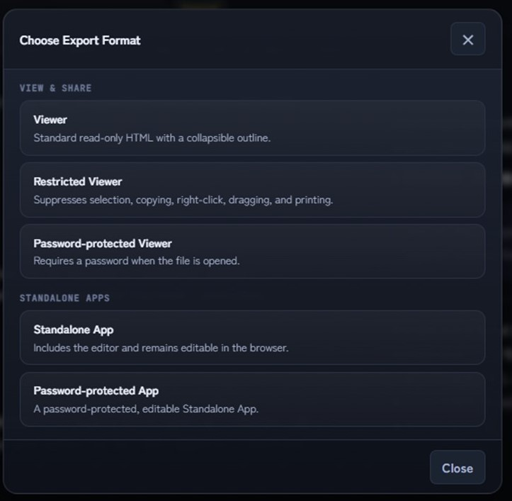

# MD//WORKS Editor User Manual

MD//WORKS Editor is a Markdown editor that runs entirely from a single HTML file.  It supports document creation, Markdown preview, file saving, exporting to HTML or PDF, saving as a standalone HTML file, and integration with browser-based AI tools. MD//WORKS works seamlessly across different OSs and browsers, but we've put together a [special manual](https://github.com/HKJPN/markdown-editor/blob/main/docs/ipad-manual.md) for iPad users to help with things like handwriting and AI.

## Image Annotations Used in This Manual

This manual uses visual annotations to indicate important areas of the screen.  
Red frames indicate where to click or select, blue frames indicate information to check, and circled numbers indicate the order of operations.

## Shortcut Notation in This Manual

This manual lists Windows / Linux and Mac shortcuts together.  
Example: **Ctrl+S / ⌘S**

When a shortcut includes Shift, the Mac notation uses **⇧**.  
Example: **Ctrl+Shift+S / ⌘⇧S**

Depending on your browser or operating system, some shortcuts may conflict with standard browser shortcuts. If a shortcut does not work as expected, use the menu bar instead.

---

## 1. Starting the App and Understanding the Screen Layout

### 1-1. Starting the App

MD//WORKS does not require installation; you can use it simply by opening the Editor's HTML file in a browser. It can also be launched directly from the [MD//WORKS Editor website](<https://hkjpn.github.io/markdown-editor/>). If unsaved data from a previous session remains, a restoration prompt may appear. If you wish to restore the data, select "Restore" on the confirmation screen.

Although installation is not required, you can convert it into an app using the following steps. Even after turning it into an app, you can switch back and forth with your browser as needed. 

#### 1-1-1. Steps to Create an App and Switch with Browser Tabs for Chrome. <br>For other browsers, please refer to Appendix 5

1. Open the [MD//WORKS Editor website](<https://hkjpn.github.io/markdown-editor/>) in the Chrome browser on your PC/Mac.
2. Select the menu (︙) in the top right corner of the screen > "Cast, save, and share" > "Install page as app".
3. Click "Install" on the confirmation screen, and a dedicated MD//WORKS icon will be created on your desktop or taskbar.
4. By simply clicking this icon, it will launch immediately as an independent window so you can begin editing.
5. When you want to use browser AI or similar features, select **"Open in Chrome"** from the menu (︙) in the top right corner. This will move you to a standard browser tab while retaining the text you are currently editing.
6. To return to the app mode and focus on writing again, click the "Open in app" button displayed at the far right of the browser's address bar.
<br>

> 💡 **If using a downloaded HTML file locally:** The install button will not appear in the address bar. Instead, open the Chrome menu (︙), go to **Save and share** > **Create shortcut**, check the **Open as window** box, and click **Create**.

#### 1-1-2. Uninstall for Chrome

If you are running the app from the HTML file or directly from the [MD//WORKS Editor website](https://hkjpn.github.io/markdown-editor/), uninstallation is not required. You can completely remove it simply by deleting the HTML file and clearing your browser cache.

If you installed it as a Chrome App, open the standalone app window, click the menu icon (︙) in the top-right corner, and select **"Uninstall MD//WORKS"**.
> *Note: If you are unable to uninstall it this way, please refer to Appendix 4.*

### 1-2. Supported Environments

MD//WORKS is compatible with almost all environments that can run a modern web browser. Please refer to [save behavior by OS and browser](#save-behavior) for detailed differences in saving behavior across various OS and browser combinations. For best results, use the latest version of a modern desktop browser such as Chrome, Brave, Edge, Firefox or Safari.

* **Device Requirements:** PC (Windows/Linux), Mac, iPad, Android tablets, Chromebook, etc., capable of running a modern web browser.
* **Screen Size:** A tablet-sized screen or larger is required. Almost all features can also be used on iPhones and Android smartphones by switching to landscape mode or using an external display.

> 💡 **Editing multiple documents in browser tabs**
> In v1.6.3 and later, each MD//WORKS tab is handled as an independent Workspace. The Auto Save content and filename, as well as work history, are kept separately for each tab, helping prevent one document from overwriting another while several documents are edited in parallel. The browser tab shows the current filename, with a `●` prefix when the document has unsaved changes.
>
> In supported environments, using the browser's **Duplicate Tab** command also separates the copy into a new Workspace automatically. The duplicated tab inherits work history up to the point of duplication; subsequent history is recorded independently in each tab. Themes such as Midnight, Paper, and Warm remain useful for visually distinguishing browsers or different kinds of work.

### 1-3. Screen Layout


* **① Menu Bar**  
  Provides access to the File, Edit, View, Help, and Latest Version Notification menus. Use it to create new files, save, export, switch views, and access help.

* **② Title Bar**  
  Displays the app name, file name, save status, and primary action buttons.  
  You can quickly open files, save, toggle Preview, enter fullscreen mode, or enable Spell (EN).

* **③ Toolbar**  
  Lets you insert headings, bold text, italics, strikethrough, superscript, subscript, lists, numbered lists, tasks, quotes, code, links, and tables with a single click.
  This is useful even if you are not familiar with Markdown syntax.

* **④ Editor Area**  
  The main area for writing and editing text in Markdown format.  
  Use this area to enter text, create headings and lists, and insert images.

* **⑤ Preview Area**  
  Renders your Markdown as formatted output.  
  You can edit on the left while checking the rendered result on the right. Toggle the preview using the **Preview** button on the title bar or **View > Preview**.

* **⑥ Status Bar**  
  Displays the current line count, word count, character count, Spell (EN) status, and storage protection mode.  
  Storage protection modes include **Auto encrypted** and passphrase-protected **Private Storage**.

---

## 2. Creating and Opening Files


### 2-1. Creating a New File

To create a new Markdown document, select **File > New (Ctrl+N / ⌘N)** from the menu bar.

If you have unsaved work, save it before creating a new file.  
Depending on the current state of the document, you may also be prompted to save the current content to History before proceeding.

### 2-2. Opening an Existing File

To continue editing a Markdown file saved on your computer, select **File > Open (Ctrl+O / ⌘O)** from the menu bar or click the **Open** button on the title bar.

Supported text-based file types include `.md`, `.txt`, and `.markdown`.

You can also open `.html` and `.htm` files and edit them as text source. When a file is a supported MD//WORKS format—such as a Restricted Viewer, Private Viewer, or Password-protected App—MD//WORKS identifies the format and performs the required restoration. HTML examples embedded in a Markdown or text file are not treated as one of these special formats.

### 2-3. Importing Word Files

You can import an existing Word document (`.docx`) and convert it to Markdown for editing.  
Select **File > Import Word (.docx)** from the menu bar, then choose the Word file you want to import.

The maximum file size is **10 MB**.

> **Note:** Word import is designed to convert document structure into Markdown. Detailed layout elements such as fonts, margins, complex charts, footnotes, and intricate tables may not be reproduced exactly. After importing, review the result in the Preview area.

> **Note:** Importing a Word file replaces the current draft. Save any important work with **File > Save (Ctrl+S / ⌘S)** before importing.

---

## 3. Entering Text


Type your content in the **Editor Area**, located in the center or on the left side of the screen.  
MD//WORKS Editor uses Markdown syntax for document creation.

### 3-1. Basic Input Example

```markdown
# Heading 1

This is the main text.

## Heading 2

- Bullet point
- Bullet point

You can also use **bold** and *italics*.
```

### 3-2. Inserting Images


You can insert small local images by dragging and dropping them into the editor area.

When inserted, the image is embedded as data within the Markdown document.  
To protect local storage capacity, image insertion is subject to the following limits:

| Item | Details |
| --- | --- |
| Maximum size | Under 300 KB |
| Supported formats | PNG, JPEG, WebP, etc. |
| Unsupported formats | SVG |

For security reasons, SVG images are not supported. Convert SVG files to PNG, JPEG, or WebP before inserting them.

> We have provided [image2md.py](https://github.com/HKJPN/images2md/tree/main) and [images2rhtml.py](https://github.com/HKJPN/images2rhtml/tree/main) as separate command-line tools for importing large numbers of images. Please utilize these tools when you need to import multiple photos at once, such as when creating reports or handouts for presentations.

| Tool | Output | Best Suited For |
| --- | --- | --- |
| **MD//WORKS** | Markdown / Viewer/ <br>Restricted Viewer HTML / Standalone App, etc. | Compiling a small number of images, editing related footnotes, and exporting a file with/without password protection later. |
| **`images2md.py`** | Markdown | Compiling a large number of images and then adding text, videos, PDFs, meeting minutes, etc., for further editing. |
| **`images2rHTML.py`** | Restricted Viewer HTML | Quickly compiling and distributing numerous image materials while restricting general copying, printing, and unintended modifications, with the option for detailed editing later. |

> 💡 **Pro Tip:** You can bypass the 300 KB image limit by using tools like `images2md.py` or `images2rHTML.py`. However, to maintain stable performance, please ensure the total file size does not exceed 20MB when re-importing into MD//WORKS.

### 3-3. Local Files and Relative Links
	
MD//WORKS Editor allows you to display and play local files such as images, videos, audio, and PDFs in the preview screen by specifying them with "relative paths." Images can also be embedded using Base64. This section explains how to display files using relative links and how to embed them.

>  **⚠️Note**:On mobile operating systems like iPadOS, local relative links do not function due to strict OS security restrictions. Please use the direct embedding method instead.

#### 3-3-1. Opening the App from a Local Folder

Relative links will function correctly by placing the MD//WORKS HTML file, your Markdown file, and all related media files within the same folder structure.

**【Example of Folder Structure】**

```text
project/
├─ index.html (App Main File)
├─ manual.md
├─ images/
│  └─ figure01.png
├─ videos/
│  └─ demonstration.mp4
└─ audio/
   └─ explanation.mp3

```

**【Example of Markdown Syntax】**

```markdown


[Open Video](videos/demonstration.mp4)

[Open Audio](audio/explanation.mp3)

<video controls src="videos/demonstration.mp4"></video>

```

With this configuration, you can smoothly view images, navigate through file links, and play compatible videos inline within the preview screen.


> 💡 **When utilizing a large amount of local media (images, videos, audio, PDFs):**
> This structure is highly recommended when you have a large number of media files or large file sizes, as it keeps MD//WORKS running lightweight and smoothly.


#### 3-3-2. Opening Local Files from MD//WORKS on the Web

When using the web version of MD//WORKS hosted on a website and selecting a Markdown file from your local computer to edit, images and other media files in the same folder will not be loaded automatically. This is a standard behavior driven by web browser security specifications (same-origin policy) and is not a malfunction of the application.

> 💡 **For a small number of images or small image sizes (up to a few tens of MBs in total):**
> Even if files cannot be automatically loaded from the folder, you can directly embed (drag and drop) images into your Markdown by referring to "3-2. Inserting Images". Images embedded in the created Markdown file have the advantage of being stably displayed inline in any environment.


### 3-4. Checking Input Status

  
The current line count, word count, and character count are shown in the status bar at the bottom of the screen.


---

## 4. Formatting Text


You can format text either by typing Markdown syntax directly or by using the toolbar.

The toolbar makes it easy to insert headings, bold text, lists, quotes, code blocks, links, and tables without memorizing Markdown syntax.

> 💡 **Cursor and selection preservation**
> When you insert H1 / H2 / H3 headings, quotes, horizontal rules, and similar Markdown elements from the toolbar, the cursor position or text selection relative to the original text is preserved, so you can continue editing without repositioning the cursor.

### 4-1. Creating Headings


Use the **H1 / H2 / H3** buttons on the toolbar to create headings.

| Button | Description | Markdown example |
| --- | --- | --- |
| H1 | Heading 1 | `# Heading` |
| H2 | Heading 2 | `## Heading` |
| H3 | Heading 3 | `### Heading` |

### 4-2. Applying Bold, Italics, and Strikethrough


Select the text you want to format, then click the corresponding toolbar button.

| Button | Description | Markdown example |
| --- | --- | --- |
| B | Bold | `**Bold**` |
| I | Italics | `*Italics*` |
| S | Strikethrough | `~~Strikethrough~~` |

To format text as inline code, wrap it in backticks.

Example: `code`

### 4-3. Creating Lists, Tasks, and Quotes


You can create bulleted lists and checklists for task management. You can apply these settings by selecting one or multiple lines simultaneously and clicking the list, number, or task buttons on the toolbar. Clicking the button multiple times will reapply or clear the formatting. You can also create blockquotes.

```markdown
- Bullet point
- Bullet point

1. Numbered item
2. Numbered item

- [ ] Open task
- [x] Completed task

> Blockquote
```

### 4-4. Inserting Code, Links, and Tables


Code blocks and tables are especially useful when writing technical notes or specifications.

```markdown
| Item | Details |
|---|---|
| File format | Markdown |
| Extension | .md |
```
### 4-5. Superscript and Subscript
In life sciences, chemistry, and physics documents, subscripts and superscripts are frequently used for chemical formulas, charges, units, and exponents. Try pasting the following into the editor and checking how it looks in the preview panel:

```markdown
H<sub>2</sub>O, CO<sub>2</sub>, A<sub>260</sub>/A<sub>280</sub>
H~2~O, CO~2~, A~260~/A~280~

Ca<sup>2+</sup>, 10<sup>6</sup> cells, cm<sup>2</sup>
Ca^2+^, 10^6^ cells, cm^2^

```

Pandoc-compatible syntax using `~` and `^` is now supported. For broader compatibility across other environments, using HTML tags is recommended.


### 4-6. Inserting Footnotes

You can add notes, supplementary explanations, or references to your text. This feature is available only via direct Markdown typing. For details on formatting footnotes in scientific reports, please refer to the [Guide to Markdown for Scientific Writing](https://github.com/HKJPN/markdown-editor/blob/main/docs/scientific-writing.md).

* **In the body text:** Insert a footnote reference like `[^note]` or `[^1]` where you want the footnote to appear. (Labels can contain alphanumeric characters, hyphens, and underscores.)
* **Footnote definition:** Type `[^note]: Your footnote text here` anywhere in the document (placing them at the end of the document is recommended).

**💡 How they are displayed**<br>
In the Preview panel and exported files (such as Viewers), footnotes are automatically sequentially numbered (1, 2...) based on their first appearance in the body text, regardless of the label used. They are collected at the bottom of the page, creating bi-directional links that allow you to jump between the reference and the footnote content.

### 4-7. Insert equations

You can insert mathematical equations used in mathematics, physics, chemistry, and other technical fields by using  [LaTeX notation](<BasicExamplesMathFormulasE.md>). Equations are formatted for clear display in the Preview pane.

* **Inline equations:** To insert an equation within a sentence, enclose it in single dollar signs (`$`).

  Example:

  ```markdown
  The equivalence of mass and energy is expressed as $E=mc^2$.
  ```

* **Block equations:** To display an equation as a separate block, place it between two lines containing double dollar signs (`$$`).

  Example:

  ```markdown
  $$
  x = \frac{-b \pm \sqrt{b^2 - 4ac}}{2a}
  $$
  ```

> **Note:** Not every LaTeX command or optional package is supported. After entering an equation, check the result in the Preview pane.

> **Offline display:** If the equation-rendering library cannot be loaded, the rest of the document will still appear in Preview, while equations will be shown in their original LaTeX notation. When the device reconnects and the library is loaded successfully, the displayed equations automatically switch to formatted output.


---

## 5. Verifying with Preview

The Preview feature allows you to see exactly how the Markdown text entered in the editor will look when rendered. In addition to basic styling like headings and bold text, you can check elements that tend to have complex structures—such as tables, footnotes, superscripts and subscripts text, and equations. Verifying your document in Preview makes it easy to spot syntax errors or layout glitches.

### 5-1. Displaying the Preview

Each time you click/tap one of the following, the display cycles through three steps: "Split View (Editor & Preview)" → "Focus Preview" → "Editor Only".

- The **Preview** button on the title bar
- **View > Preview** in the menu bar


#### 5-1-1. Split View (Editor & Preview)

The Markdown editor is displayed on the left side of the screen, and the Preview is displayed on the right side.
As you edit the text on the left, the changes are reflected in the Preview in real time, allowing you to write while instantly checking the final output. This is especially useful when adjusting tables, footnotes, and images. You can adjust the width of the panes by dragging the splitter between the editor and the preview.

#### 5-1-2. Focus Preview

This mode expands the Preview to full width, allowing you to focus on reading the document. By opening the Outline panel and selecting a heading, you can quickly jump to that specific section. This view is ideal for reviewing the entire document, proofreading, collaborative reading, or giving simple presentations.

To return to the editor from Focus Preview, use one of the following methods:

- Click/tap **Preview** again on the title bar or menu bar.
- Click/tap the **Return to Editor** button on the screen.

### 5-2. Content Verifiable in Preview

The Preview panel mainly supports rendering and verifying the following elements:

- Headings
- Bold, Italic, and Strikethrough text
- Superscripts and Subscripts
- Bulleted and Numbered lists
- Task lists (Checklists)
- Tables
- Blockquotes
- Footnotes
- Inline code and Code blocks
- Hyperlinks
- Images


---

## 6. Saving Files


You can save your document as a standard Markdown file.

### 6-1. Saving as a Markdown File

1. Click the **Save** button on the title bar.  
   Alternatively, select **File > Save (Ctrl+S / ⌘S)** from the menu bar.
2. Choose a destination folder if prompted.
3. The document is saved as a Markdown file.

You can also use the shortcut shown above.  
To save the file under a different name, use **File > Save As (Ctrl+Shift+S / ⌘⇧S)**.

### 6-2. Renaming the File


Click the file name field in the title bar to rename the document.  
For example, you can change `untitled.md` to `meeting-note.md` or `manual-draft.md`.

### 6-3. Checking Save Status


The title bar shows the current save status.

| Indicator | Meaning |
| --- | --- |
| Unsaved | The document contains unsaved changes |
| Saved | All changes have been saved |


If you edit the document after saving, the status changes to **Unsaved**.  
Always check this status before closing the app or ending your work session.

### 6-4. Understanding Local Draft Protection

MD//WORKS Editor protects browser-stored drafts and history with **Auto encrypted** so they are not saved locally in plain text.

For stronger protection or to remove stored data, use the following features:

* **Private Storage**: Adds passphrase-based protection to drafts and history stored in the current browser.
* **Clear Local Data**: Available under **Storage Security** in the File menu. This removes all protected drafts and history stored in the browser.

> **Important:** Auto encrypted and Private Storage protect browser-based drafts and history. They do not replace saving your document as a file. To keep your work permanently, save it as a `.md` file with **File > Save (Ctrl+S / ⌘S)**.

### 6-5. Private Storage vs. Private App Export

Both **Private Storage** and **Save as Private App** use passphrases, but they serve different purposes.

| Feature | Purpose | Protected data |
| --- | --- | --- |
| Private Storage | Protects drafts and history stored in the current browser | Local browser data |
| Save as Private App | Exports the current document as a passphrase-protected HTML file | The exported HTML file |

If you forget the passphrase, the protected data cannot be recovered.  
For important documents, keep a separate Markdown backup (`.md`) in a secure location (see "13-18. Long-term access and compatibility of encrypted files" for details on managing passwords for long-term storage).

### 6-6. Restoring from History


Select **File > History** to view saved draft states.  
Use this feature if you accidentally delete content or want to return to an earlier draft.

When editing in multiple tabs, work history is managed independently for each tab's Workspace. After restarting MD//WORKS, saved history from all Workspaces is shown together for review and recovery. Once editing begins in a tab, only that tab's history is displayed. Saved history entries show the actual file name confirmed at the time of saving.

Running **Clear Local Data** also deletes History.  
Do not rely on History as your only backup for important documents.

<a id="save-behavior"></a>
### 6-7. Saving behavior depends on your browser

MD//WORKS Editor is designed to work across a wide range of environments, including Windows, macOS, iPadOS, Android, ChromeOS, and Linux. The behavior for saving and **overwriting files** varies depending on your device and browser combination. This is due to browser-specific security specifications (File System Access API support).

| OS / Platform       | Chrome / <br>Edge| Brave  | Firefox   | Safari   |
| ------------------- | ----------------------------------------------------------------------------------------------------------- | --------------------------------------------------------------------------------- | ----------------------------------------------------------------------------------------- | -------------------------- |
| **Windows / Linux** | **Direct overwrite is supported** after the initial save.                                                   | Overwrite manually using **“Download As”** to **a folder of your choice**. | Downloads as a new file with a **numbered suffix**. | —                          |
| **macOS**           | **Direct overwrite is supported** after the initial save.                                                   | Overwrite manually using **“Download As”** to **a folder of your choice** . | Downloads as a new file with a **numbered suffix**. | Same as **Firefox**.       |
| **iPadOS**          | Saves as a new file with a numbered suffix to **a folder of your choice** via the **Files app.**| Same as **Chrome / Edge**.                                                        | Same as **Chrome / Edge**.                                                                | Same as **Chrome / Edge**. |
| **Chromebook**      | Direct overwrite is **supported** after the initial save.                                                   | Overwrite manually using **“Download As”** to **a folder of your choice**. | Downloads as a new file with a **numbered suffix**. | —                          |
| **Android Tablet**  |🚫 `.md` downloads are not supported. Use the `.txt` extension instead.                                     | Downloads as a new file with **a numbered suffix.** | Same as **Brave**.                                                                        | —                          |
> **To Firefox, Safari, and Mobile Users:**
> Due to browser security restrictions, direct overwrite saving to local files is unavailable. Each time you click the save button, the file will be downloaded with a version history number appended (e.g., `filename(1).md`). This allows you to keep track of previous save versions for the same file.

---

## 7. Exporting to HTML and PDF


In addition to saving as a standard Markdown file, MD//WORKS Editor allows you to export your documents in multiple formats depending on your needs.

### 7-1. Document Sharing and Protection via Flexible Export Features

MD//WORKS features the ability to export your documents as a single HTML file. This enables secure document sharing, collaborative writing, and long-term archiving in a format tailored to your purpose, without relying on the recipient's system environment.

You can choose from the following two categories of export formats based on your needs:

**1. View-Only Formats (Viewer Formats: 3 types)**
Specialized for viewing documents. These formats are ideal for secure information disclosure, such as distributing presentation materials.

* **Standard:** A highly readable format featuring a built-in outline (table of contents).
* **Restricted:** Disables unauthorized text copying and printing operations.
* **Password-Protected:** Requires a password to view the document, ensuring the protection of sensitive information.

**2. Editable Formats (Standalone App Formats: 2 types)**
Packages the created document data and the application's editor features into a single output file.
Recipients of the file can instantly resume editing simply by opening it in a web browser—no dedicated software installation is required. Password protection is also available for this format.

**■ Recommended Formats by Use Case**

* **For presentation only:** We recommend the "Restricted Viewer Format" for distributing materials such as handouts.
* **For collaborative editing:** Use the "Standalone App Format" when requesting the recipient to add or edit content (Standalone Save).



| Format | Editable in <br>MD//WORKS | Password <br>Protection | Copy / Print |
| --- | --- | --- | --- |
| Viewer | 🚫 No | 🔓 None | 🖨️ Allowed |
| Restricted <br>Viewer | ✔ Yes | Viewing: <br>🔓 Not required/<br>Restoring: <br>🔐 Required | 🛡️ Restricted |
| Password-<br>protected Viewer | ✔ Yes | 🔐 Yes | 🖨️🔓 <br>Allowed after <br>unlocking |
| Standalone App | ✔ Yes | 🔓 None | 🖨️ Allowed |
| Password-<br>protected App | ✔ Yes | 🔐 Yes | 🖨️🔓 <br>Allowed after <br>unlocking |


> 💡 **About the Restricted Viewer password**
> 
> No password is needed to open and view a Restricted Viewer file. The password you set is only used when you **restore** the original Markdown back into MD//WORKS for re-editing — it is not required for viewing.
<br clear="all">
For important documents intended for long-term storage, see "13-18. Long-term access and compatibility of encrypted files" for guidance on keeping the original Markdown file, the password, and the HTML file of the MD//WORKS version used.


### 7-2. Printing or Saving as PDF

Select **File > Print / Save as PDF...** to open the MD//WORKS Print / Save as PDF menu. From this menu, you can choose to print the rendered Preview, the Markdown source, or the Markdown source with line numbers.

To export as a PDF, choose **Save as PDF** as the destination in your browser’s print dialog. You can also turn off **Headers and footers** in the browser’s print settings to remove browser-generated information such as the URL, date, and page numbers, producing a cleaner output.

- **Preview**  
  Prints the rendered HTML view of your Markdown while preserving its formatting.

- **Markdown Source**  
  Prints the Markdown syntax as plain text. Use this option when printing HTML source files or code.

- **Markdown Source ☑ Include Line Numbers**  
  Prints the Markdown source with logical line numbers. This is useful for line-by-line review and comments on academic papers, patent drafts, code, and other long-form documents.


> When printing or saving as PDF, use **File > Print / Save as PDF...** in MD//WORKS instead of the browser’s standard Ctrl+P shortcut. Ctrl+P prints the current browser screen directly, which may include the app UI or cause page breaks to differ from MD//WORKS’ optimized print output.
>
> If you open a `.html` / `.htm` file or HTML source code, Preview printing may interpret it as HTML and produce broken output. When printing HTML source or code, use **Markdown Source** or **Markdown Source ☑ Include Line Numbers** instead.


---

## 8. Search, Replace, and Final Touches
MD//WORKS Editor provides tools to search and replace text strings across your document, as well as an automatic table of contents generator. These features are highly useful when editing long drafts, meeting minutes, specifications, or research notes.

### 8-1. Finding Text

To search within the document, select **Edit > Find (Ctrl+F / ⌘F)** from the menu bar.

#### Steps

1. Click **Edit** on the menu bar.
2. Select **Find**.
3. Enter the text you want to find.
4. Matching text is highlighted in the editor.
5. Use the **↑ / ↓** buttons to move between results.
6. **Close the Find/Replace panel:** Press `Esc` or use the × button in the upper-right corner. Only the panel closes; the search highlights remain.
7. **Clear search highlights:** With the panel closed, press `Esc` again to clear the highlights. The search text and options are retained, so reopening the panel resumes the search with the same settings. As you edit the document, the remaining highlights update to match the current content.


### 8-2. Replacing Text


To replace text, select **Edit > Replace (Ctrl+H / ⌘H)**.

#### Steps

1. Select **Edit > Replace**.
2. Enter the text you want to find in the upper field.
3. Enter the replacement text in the lower field.
4. Click **Replace** to replace one match at a time.
5. Click **Replace All** to replace all matches at once.


### 8-3. Using Search Options


The Find and Replace panel provides the following options:

| Option | Description |
| --- | --- |
| [RegExp](regex-recipes.md) | Enables [regular expression](regex-recipes.md) search |
| Case Sensitive | Matches uppercase and lowercase letters exactly |
| Whole Word | Matches complete words only |

### 8-4. Formatting Markdown


Select **Edit > Format Markdown** to clean up excessive blank lines and trailing spaces.  
Running this before sharing, submitting, or exporting helps keep the document clean and consistent.

### 8-5. Inserting a Table of Contents
Selecting **Edit > Insert Table of Contents** automatically generates a clickable, linked table of contents based on the headings (`#` to `###` / H1 to H3) in your document.

> 💡 **Tip: Choosing the Right Tool**
> For navigating your document while editing in MD//WORKS, we recommend using the **Outline View** on the right side of the screen.
> This "Insert Table of Contents" feature is designed for the **final polishing stage** of your document—such as right before handing a Markdown file over to someone else or exporting it to HTML/PDF.


### Usage and Important Notes
* **Inserting for the First Time**
  Place your cursor exactly where you want the table of contents to appear (e.g., right after the document title or before the main body text) and then run the command.

* **Updating the Table of Contents**
  If a table of contents previously inserted by MD//WORKS already exists in the document, running the command will **automatically locate and update the existing table of contents with the latest heading structure**, regardless of where your cursor is placed (it will not create a duplicate).

* **Manually Editing the Table of Contents**
  The generated table of contents is inserted as regular text, so you can freely modify it. However, please note that if you run **Edit > Insert Table of Contents** again to refresh it, **any manual edits you made within the table of contents will be overwritten and reset** based on the latest headings. If you need to make manual fine-tunings, it is highly recommended to do so at the very end, just before exporting.

> 📄 **Note on Links in Exported PDFs**
> When saving your document as a PDF, the table of contents can still function as in-page clickable links depending on your viewing environment (this has been verified using the standard "Microsoft Print to PDF" feature on Windows). Since behavior may vary depending on the browser or PDF viewer used, we recommend testing the links once before distributing your file.

---

## 9. Changing View Settings


The View menu lets you toggle Outline, Show Invisibles, Show Line Numbers, Highlight Current Line, Wrap Lines, Theme, Fullscreen, Spell (EN), and Zen Mode.

### 9-1. Using Outline


Select **View > Outline** to display a list of headings in the document.

Outline extracts Markdown headings such as `#`, `##`, and `###`.  
In long documents, click a heading to jump directly to that section. This makes it easier to review structure and navigate quickly.

### 9-2. Showing Invisible Characters


Select **View > Show Invisibles** to reveal characters that are normally hidden.

Examples include:

| Character | Use case |
| --- | --- |
| Full-width spaces (`□`)| Checking accidental spaces or inconsistencies |
| Tabs  (`→`) | Checking indentation |
| Trailing spaces (`·`)| Identifying causes of Markdown formatting issues |
| Line breaks (`↵`) | Confirming paragraph and list spacing |

In Markdown, the positions of spaces and line breaks can affect the display results. Full-width spaces, tabs, trailing spaces, and line break positions are displayed very faintly in any screen mode as shown below.


### 9-3. Showing Line Numbers
Select **View > Show Line Numbers** to display logical line numbers on the left side of the editor. This feature is disabled by default.

Key features and considerations include:
* **Logical Line Numbering**: Numbers are counted based on line breaks. If a long single line wraps into multiple visual lines on the screen, the line number will only appear at the beginning of that logical line.
* **Display-Only Overlay**: Line numbers are strictly for visual reference. They are entirely excluded from file saving, text copying, searching, word/character counts, and spell checking.
* **No Impact on Preview or Outputs**: Line numbers will not appear in the Preview panel, preview printing, or any exported Viewers and standalone applications.

This is highly useful for organizing long documents, exchanging precise editing feedback (e.g., "please correct line X"), or doing light coding.

### 9-4. Highlighting the Current Line
Select **View > Highlight Current Line** to apply a subtle background highlight to the logical line where the cursor (input focus) is currently positioned. This feature is enabled by default.

Key benefits and characteristics include:
* **Never Lose Your Place**: Easily track your editing position at a glance, even after scrolling, jumping to search results, or during text input.
* **Coexistence with Other Highlights**: The tint is designed to be extremely soft, ensuring it does not interfere with the visibility of search highlights, spell-check markers, task lines, or text selections.
* **Independent Operation**: You can enable this highlight independently even when "Show Line Numbers" is turned off, allowing you to focus entirely on writing.
* **No Impact on Outputs**: This highlight has absolutely no effect on the Preview, saved files, printouts, or any exported files.

### 9-5. Toggling Line Wrapping (Wrap Lines)

Use **[View] > [Wrap Lines]** to choose whether text in the editor wraps to fit the width of the editing area. Line wrapping is enabled by default.

This setting changes only how the document is displayed in the editor. It does not insert or remove line breaks and does not alter the contents of the saved file.

* **On (Wrap Lines) — Recommended for general writing**
  This mode is well suited to long-form documents such as research papers, reports, and novels. Text automatically wraps at the right edge of the editor, allowing you to read and edit without horizontal scrolling.

* **Off (No Wrap) — Recommended for code and long single-line data**
  This mode is useful for source code such as Python or JavaScript, CSV data, log files, and embedded image data such as Base64. Long logical lines remain on a single line, making indentation and data structure easier to inspect. Text that extends beyond the width of the editor can be viewed using the horizontal scrollbar.

Disabling line wrapping may also make it easier to keep the editor and preview positions aligned when working with documents that contain extremely long lines, such as Base64 data.

When a search result is located beyond the right edge of the editor, MD//WORKS automatically scrolls horizontally to bring the matching text into view.

### 9-6. Changing Themes


Change the interface theme from the **View** menu.

| Theme | Description |
| --- | --- |
| Midnight | Dark theme designed for focused editing |
| Paper | Bright theme suitable for document writing and review |
| Warm | Soft sepia theme for long-form writing |

Choose a theme based on your working environment: **Paper** for reviewing, **Warm** for long writing sessions, and **Midnight** for focused editing.


### 9-7. Fullscreen Mode


Use **View > Fullscreen** or the fullscreen icon on the title bar to expand the browser to fullscreen mode.

This is useful when you want a wider workspace or need to review the document before a presentation.

### 9-8. Using Spell (EN)


Enable the English spell checker with **View > Spell (EN)** or the **Spell (EN)** button on the title bar.

When Spell (EN) is enabled, possible English spelling errors are detected. You can review suggestions, ignore words, or add words to the dictionary.

This feature is intended for English text only and does not provide proofreading for other languages.

### 9-9. Focusing with Zen Mode


Select **View > Zen Mode** to hide menus, toolbars, and panels, creating a distraction-free writing environment.

Zen Mode is useful for long drafting sessions, manuscript writing, and focused proofreading.  
To exit, click the **✕** button in the upper-right corner of the screen.

---

## 10. Recording the Editing Process with Deep Edit Mode

Deep Edit mode is a feature that separately records the "process" of your editing in the browser's temporary memory, alongside the final "result" of the document. Because it allows you to review the flow of your edits—including significant additions and deletions—in chronological order, it is highly useful when performing complex revisions on reports, novels, and long manuscripts.

Because the Deep Edit log is kept completely separate from the main text, it does not affect your Markdown source, saved files, Auto Save, work history, or Undo/Redo history. However, the log is only saved temporarily in the browser's memory and will be erased when the page is reloaded. Please copy and save any necessary logs in advance.

### 10-1. Start and Stop

* **Start:** Press the **DEEP** button on the title bar or select **View > Deep Edit Mode**. A Deep Edit session will start, and the **DEEP** button will light up. If an existing Deep Edit log remains in memory, you will be prompted to confirm whether to clear it and start a new session.
* **Stop:** Press the **DEEP** button again or select **View > Deep Edit Mode** once more to turn it off. Recording of new events will stop, but the existing log will be retained temporarily until the page is reloaded.

### 10-2. How Editing and Recording Works

Edit your document as usual. Deep Edit mode does not directly alter your text; rather, it silently records your editing process in the background. Continuous typing—including spaces, punctuation, and standard backspacing—is grouped into one normal editing event after approximately five seconds to keep the log readable. Uncommitted text during IME composition is not recorded. For normal typing events, MD//WORKS records the final changes based on the difference between the document state at the beginning and end of the typing batch.

If a selected text range of 100 characters or more is replaced through normal text input, it will be recorded intelligently as two separate events: a large deletion followed by an input event.

### 10-3. Checking and Utilizing Logs

Open the log panel from **View > Deep Edit Log**. After making significant changes, reviewing the log helps you retrace your thought process and decide whether to make further revisions or save the document as a new version.

* **Display Contents:** The log shows the operation time, event type, edited location (e.g., previous heading, previous/next line), and character count changes (e.g., `+128`, `-340`). For save/file operation events, the saved name or opened file name is also displayed. A line break entered by itself is shown as `[New line]` (or, for example, `[New lines × 2]`), making Enter-only edits visible instead of appearing as an empty entry.
* **Copy Log:** Use the **Copy Log** button to copy the entire log to your clipboard.
* **View JSON:** Use the **View JSON** button to display the raw internal Deep Edit log data in JSON format. You can then select and copy it manually if needed.

### 10-4. Using AI to Review the Editing Process

The Deep Edit log can be used not only for reviewing the editing process yourself, but also for having a browser AI capable of referencing screen content, such as Gemini or Leo, analyze your writing process from an objective third-party perspective.

With the Deep Edit log open, you can enter a prompt like the following into your AI assistant:

> Please review the document currently being edited along with the DEEP EDIT LOG, and summarize the following 4 points:
> 1. The main changes and shifts in focus made during this session.
> 2. Any important information or context that was deleted.
> 3. Revisions or sections that appear to be incomplete.
> 4. Overall quality concerns or suggestions for the document.

For instructions on how to set up AI writing assistance, please refer to "12. AI-Assisted Writing" later in this manual.

### 10-5. Clearing the Log

Use the **Clear Log** button to delete the current log. If you clear the log while Deep Edit mode is still ON, the mode will continue, and recording will seamlessly resume in a new empty session.

*Note: Clearing the log does not affect the main manuscript text, saved files, Auto Save, work history, or Undo/Redo history.*

### 10-6. Limitations

* The Deep Edit log is strictly for you or an AI to review your edit history; it does not have a feature to automatically restore the main text to a previous state.
* It does not display color-coded inline diffs (like Track Changes in Microsoft Word).
* There is no feature to individually "Accept" or "Reject" recorded changes.
* It is not intended as a substitute for a complete audit trail or a dedicated version control system (like Git).
* Logs are strictly retained in the browser's temporary memory and will be permanently cleared when the page is reloaded.
* Log recording is capped at a maximum of 500 events per session. Once this limit is reached, you will be notified and no further events will be logged, though you can continue editing your document without interruption.

### 10-7. Main Recorded Events

* **Editing:** Normal edits (grouped into approximately five-second batches), large deletions (100+ characters), overwriting a selection of 100+ characters through normal text input (recorded separately as deletion and input), and pasting. Line breaks are displayed clearly in normal editing events, and the Previous line context is recorded from the final edit location.
* **Operations:** Replace all, Format Markdown, Update TOC, Add image, and Rename document.
* **File:** Save, Save as, Download, Open file (Markdown / Word / Normal Viewer HTML), Open Word file, and Restore from work history.
* **Other:** Undo / Redo executions.

### 10-8. Excluded / Unrecorded Events

* Character-by-character input (keystrokes are grouped into batches after a short delay to prevent log clutter).
* The actual Base64 image/file data (omitted as `[embedded data omitted]` or `[embedded image data omitted]` to save memory).

### 10-9. Behavior When Switching Documents

* **Retain Log:** When restoring from an existing file, importing a Word file, or restoring from work history, the log is retained and recording continues.
* **Clear Log:** When creating a new file, closing a file, restoring from a Restricted Viewer, or restoring from a Private Viewer, the previous log is cleared. If Deep Edit mode was active, recording continues in a new empty session. If you wish to keep the previous log, please save it in advance using **Copy Log**.

---

## 11. Help and Keyboard Shortcuts


The Help menu provides access to Quick Start, Keyboard Shortcuts, the GitHub page, and app information.  
Because the help content is embedded in the app, it can be viewed offline.

### 11-1. Quick Start


Select **Help > Quick Start** for a brief overview of MD//WORKS Editor.

Quick Start covers:

* Entering Markdown
* Using the toolbar for formatting
* Previewing documents
* Saving files
* Exporting as a standalone app
* Finding and replacing text
* Formatting Markdown
* Working offline

### 11-2. Keyboard Shortcuts


Select **Help > Keyboard Shortcuts** to view available shortcuts.

Common shortcuts include:

| Action | Shortcut |
| --- | --- |
| New File | Ctrl+N / ⌘N |
| Open | Ctrl+O / ⌘O |
| Save | Ctrl+S / ⌘S |
| Save As | Ctrl+Shift+S / ⌘⇧S |
| Undo | Ctrl+Z / ⌘Z |
| Redo | Ctrl+Y / ⌘⇧Z |
| Cut | Ctrl+X / ⌘X |
| Copy | Ctrl+C / ⌘C |
| Paste | Ctrl+V / ⌘V |
| Select All | Ctrl+A / ⌘A |
| Find | Ctrl+F / ⌘F |
| Replace | Ctrl+H / ⌘H |
| Close the frontmost panel or modal | ⌘ + . or Esc |
| Clear search highlights | Esc (when no panel or modal is open) |

When the Preview area is selected, you can use **Ctrl+A / ⌘A** to select all preview content. Rich copy is also supported.

### 11-3. GitHub / About MD//WORKS


To view the source code or release notes, select **Help > GitHub**.  
To check the app version and core concepts, select **Help > About MD//WORKS**.

---

## 12. AI-Assisted Writing 

MD//WORKS is not only a plain text and Markdown editor. It can also be used together with browser-based AI assistants, such as Gemini in Chrome and Leo in Brave, to support a wider range of writing tasks.

AI features are not built directly into MD//WORKS itself. However, when used alongside a browser AI assistant, MD//WORKS can help with routine tasks such as proofreading, translation, checking terminology consistency, and correcting inconsistent wording. It can also be useful for more structural tasks, such as reviewing the organization of a Markdown document, explaining code, or organizing reference notes while writing.

By offloading these supporting tasks to AI, you can reduce the cognitive burden of writing and focus more on the creative and substantive aspects of your work. This chapter explains how to prepare your browser AI environment, how to use it effectively, and what to keep in mind when using AI assistants with MD//WORKS.

### 12-1. Preparing to Use AI Writing Assistance

MD//WORKS can be used with several browser-based AI assistants. This section explains the basic setup for using Gemini in Google Chrome and Leo in Brave Browser.

#### 12-1-1. Google Chrome: Using Gemini

1. **Sign in to your Google Account**  
   Make sure you are signed in to your Google Account in Chrome.

2. **Open Gemini**  
   Launch Gemini from the browser side panel, the toolbar button, or the “Ask Gemini” option. If you are launching MD//WORKS from the app, select 'Open in Chrome' from the menu (︙) in the top right corner of the screen, return to the browser tab, and then launch it from 'Ask Gemini'."

3. **Ask Gemini to review or summarize your document**  
   With MD//WORKS open, you can ask Gemini to proofread, summarize, translate, or review your document. You can work with the entire document, or select only a specific section. In many cases, simply selecting text with the cursor is enough to limit the scope of the AI request, without copying and pasting the text manually.

> Note: The availability and behavior of Gemini in Chrome may vary depending on your Chrome version, Google Account, region, plan, and organizational settings.

#### 12-1-2. Brave Browser: Using Leo 

1. **Open Leo from Brave Browser**  
   No login is required. Click the AI chat icon on the right side of the address bar, or open it from the “…” menu.

2. **Ask Leo to review or summarize your document**  
   With MD//WORKS open, you can ask Leo to proofread, summarize, translate, or review the current document. You can also select a specific section and ask Leo to work only on that part. As with Gemini, this can often be done by selecting the relevant text directly, without manual copy and paste.

> In our testing, Leo worked smoothly with MD//WORKS, including on mobile environments such as iPad. It was able to read the page structure with a level of accuracy close to the desktop version, even when the HTML structure was relatively complex or imperfect. Brave may therefore be a useful option when you want AI assistance without relying on a Google account, or when you want a more privacy-oriented browser environment.

#### 12-1-3. Local LLM

It is also possible to build a "completely local LLM environment" without sending any data to the internet. For local setup instructions, please refer to [Appendix 1 and 2](#appendix-1-2-local-llm) in this document. If you want to use an OpenAI-compatible external cloud API from a browser assistant instead of a local model, see [Appendix 1-4](#appendix-1-4-how-to-use-openai-compatible-cloud-apis-eg-muse-spark-11-with-brave-leo-or-page-assist).

### 12-2. Example Use Cases

In addition to everyday text proofreading, summarization, terminology consistency checks, and simple coding support, it can also perform tasks such as "identifying inconsistencies in quality assurance documents" and "reviewing the overall structure of long documents." Examples of specific prompts are provided.

#### For Papers, Articles, and Technical Documents

* Identify inconsistent terminology or wording in this document.
* Summarize the entire document in about 300 Japanese characters.
* Review the selected section and rewrite any unnatural expressions in a more academic and objective tone.
* Check the selected English text for grammar mistakes.
* Extract only the headings from this chapter.
* Would the structure be clearer if Section C were moved after Section D?
* Review the order of the chapters and suggest a more readable structure.
* Organize these reference notes and check whether each source supports the corresponding claim in the main text.

#### For Simple Coding Support

* Create a regular expression pattern to replace all half-width parentheses in this document with full-width Japanese parentheses.
* Convert the experimental process described in the selected text into a Mermaid flowchart.
* Add explanatory comments to each line of the selected Python code.
* Explain the cause of the error in this R code and suggest how to fix it.
* Explain what this JavaScript function does in a way that a beginner can understand.
* Rewrite the specifications being edited as an implementation prompt for Codex.

#### Long-Form Text Rewriting Support

We have verified that MD//WORKS is capable of assisting with the rewriting of large documents (ranging from tens of thousands to a hundred thousand characters) when used in conjunction with top-tier AI models (frontier models). When targeting long documents, it is convenient to request a list of all rewrite suggestions in a single response. Please refer to Appendix 6 for a compilation of useful prompt examples.

### 12-3. Important Notes When Using Browser AI

When you use a browser-based AI assistant, the entire visible document or the selected area may be processed by the AI service. If you are working with confidential information, personal data, or internal company documents, always check what information is being shared and how your browser or organization manages AI access.

For documents that should not be shared with AI services, consider using a browser or environment where AI access can be disabled or strictly controlled.

If you do not want Gemini in Chrome to access the content of your MD//WORKS tab, avoid sharing that tab with Gemini, or use a browser such as Firefox where AI access can be blocked or more tightly controlled.

### 12-4. Differences Between Browser AI Assistants

The following comparison is based on our own testing with MD//WORKS. The behavior of each AI assistant may change depending on the browser version, AI service updates, account settings, subscription plan, and organizational policy.

| Item | Copilot in Edge<br>  | Gemini in Chrome<br>  | Brave Browser / Leo<br>  | Firefox AI Controls<br> |
| :--- | :--- | :--- | :--- | :--- |
| **AI integration with MD//WORKS** | 🚫 Mainly copy-and-paste based, even when the sidebar is available | ✅ **Can analyze the overall document structure or selected areas** | ✅ **Can analyze the overall document structure** | 🚫 Mainly copy-and-paste based, even when the sidebar is available |
| **Real-time Context Awareness** | 🚫 **Limited**<br>Requires manual trigger; context updates only when panel is refreshed or explicitly instructed | ✅ **Full Real-time**<br>Directly monitors DOM & selection; updates instantly as you type or select | ⚠️ **Snapshot-based**<br>Captures state when opened; does not auto-sync with ongoing typing without reopening | 🚫 **None**<br>Relies on copy-paste or manual page summary|
| **AI support on iPad** | 🚫 Not available | 🚫 Not available | ✅ **Available** | 🚫 Not available |
| **Model selection** | 🚫 Not available | 🚫 Not available (Limited to Pro and Flash) | ✅ **Available** | ✅ Available when using a local or configurable AI setup |
| **Security / privacy orientation** | Best suited for managed Microsoft 365 environments; ✅**local LLM** usage is also possible | Depends on Google Workspace and account settings; ✅**local LLM** usage is also possible  | Minimizes unnecessary data sharing and offers privacy-oriented controls; ✅**local LLM** usage is also possible | ✅Can **block AI** access; ✅**local LLM** usage is also possible |
| **Recommended use** | Organizations that prioritize **Microsoft 365 governance** | Writing, proofreading, and review using **powerful AI models** | Writing, proofreading, **mobile use**, and **model selection** | Users who want **strict AI control**, AI blocking, or a fully local AI option |

#### For Users Who Want a Smooth and Easy AI Writing Environment

Our testing confirms that MD//WORKS features high compatibility and seamless performance with Google Chrome’s Gemini and Brave’s Leo. Due to the differences in how they recognize context (Real-time Context Awareness), we recommend choosing the right tool for your specific task:

* **Gemini in Chrome (for real-time assistance):** Updates instantly as you type or select text, making it ideal for targeted rewriting, fine-tuning expressions, and partial edits while you actively write.
* **Leo in Brave Browser (for overall reviews):** Analyzes a snapshot of the document when the sidebar is opened. This makes it perfect for full-document proofreading, summarization, consistency checks, and structural reviews once a draft is complete. It also offers stable performance on mobile devices like iPads.

#### For Strict Security and Corporate Policies

In the case of Gemini in Chrome, it is protected under a Workspace agreement. Copilot allows for management based on Intune/DLP integration. For guidance on handling confidential information and controlling AI access, see "12-3. Important Notes When Using Browser AI".

### 12-5. AI Sidebar and Full-Screen Mode Behavior

When using the AI sidebar, switching to full-screen mode is highly recommended to maximize your workspace. However, depending on your browser, you may experience better stability by using your browser's native full-screen shortcut rather than the "Full Screen" button within MD//WORKS. For more details, please refer to [Appendix 3: Full-Screen Behavior and Browser Compatibility](#appendix-3-fullscreen-browser-compatibility).

---

## 13. Troubleshooting

This section covers common issues and how to resolve them.

### 13-1. The title bar shows “Unsaved”


**Unsaved** means the document has been modified since the last save.  
Before ending your work session, save the document using the **Save** button or **File > Save (Ctrl+S / ⌘S)**.

After the file is saved, the indicator returns to **Saved**.

### 13-2. I saved the document, but I cannot find the file

First, check your browser’s default Downloads folder.  
Saving and export operations follow your browser’s download settings. Also confirm that the name in the file name field matches the downloaded file.

Remember that **Auto encrypted** only protects drafts and history stored in the browser. It does not create a `.md` file on your computer (see "6-4. Understanding Local Draft Protection" for details). To keep a regular file, use **File > Save (Ctrl+S / ⌘S)**.

### 13-3. Cannot Save Directly to the Cloud

**Cause**

MD//WORKS intentionally does not support direct cloud storage integration. This is a deliberate design choice to ensure the long-term safety, privacy, and reliability of your data:

* **Privacy:** All processing remains strictly within your browser. By not connecting to external servers, the risk of data leaks is eliminated.
* **Longevity:** Avoiding built-in reliance on external cloud storage or AI APIs prevents the application from breaking if those services suddenly change or shut down.
* **Reliability:** Official desktop sync apps are much more stable and less prone to file corruption from network errors compared to direct browser uploads.

**Workaround**

To sync your documents to the cloud, please save your files directly into your local cloud sync folder (such as OneDrive, Google Drive, iCloud, or Dropbox) on your device. Your cloud provider's desktop application will automatically and safely handle the synchronization.

### 13-4. I cannot paste from the menu

Browser security restrictions may block paste operations from custom menus.  
If this happens, use the keyboard shortcut **Ctrl+V / ⌘V**.

### 13-5. Pressing the Home / End keys in the editor does not move the cursor to the beginning or end of the document.

In the editor, the Home / End keys are assigned to **move the cursor to the beginning or end of the current line** to allow for smoother text input and editing. (Note: In the Preview screen, they will move to the beginning or end of the entire document.)

To move to the beginning or end of the entire document, please use the following shortcuts:

* **Ctrl + Home** – Go to the beginning of the document
* **Ctrl + End** – Go to the end of the document
* For Mac / iPad: **⌘ + ↑** / **⌘ + ↓**

### 13-6. I cannot insert an image

If drag-and-drop image insertion does not work, check the following:

| Item to check | Solution |
| --- | --- |
| The image is too large | Compress it to under 300 KB |
| The image is an SVG file | Convert it to PNG, JPEG, or WebP |
| The file is not an image | Use a valid image file |

To protect local storage capacity and improve security, MD//WORKS Editor does not accept images over 300 KB or SVG files (see "3-2. Inserting Images" for details).

### 13-7. Preview is not displayed

If Preview does not appear, make sure it is enabled by clicking the **Preview** button on the title bar or selecting **View > Preview**.

On narrow screens, Preview may appear as a full-width pane or may be out of view.  
When Preview is active, you can drag the central divider to adjust the width of the editor and preview panes.

### 13-8. Search returns no results

If search returns no results, check the search options, such as **Case Sensitive**, **Whole Word**, and **RegExp**.

The issue may also be caused by full-width/half-width character differences or invisible spaces. Turn on **View > Show Invisibles** to inspect the text if necessary.

### 13-9. “Invalid regular expression” appears


When **RegExp** is enabled, your search input is interpreted as a regular expression.  
If the syntax is invalid, an error appears.

If you do not intend to use regular expressions, turn off **RegExp**.

### 13-10. Spell (EN) is not working

Spell (EN) is designed for English text only and does not proofread other languages.

Make sure Spell (EN) is enabled and that the document contains English text.  
Depending on your network environment, the dictionary data may take a few seconds to load.

### 13-11. Equations are not displayed correctly in Preview

The equation-rendering library used to format equations is loaded from the internet, or from the browser cache if it has already been downloaded.

When MD//WORKS is opened completely offline for the first time, or after the browser cache has been cleared, the equation-rendering library may not be available. In this case, the regular Markdown content will still appear in Preview, while equations will be displayed in their original LaTeX notation.

When the internet connection is restored, MD//WORKS automatically attempts to load the equation-rendering library again. If the download succeeds, the equations currently displayed in Preview will switch to formatted output without requiring the page to be reloaded.

If the equations do not switch to formatted output, check the following:

* Confirm that the device is connected to the internet.
* Check whether access to the external CDN is blocked by the browser, security software, or your organization’s network.
* Confirm that the equation is enclosed correctly in half-width `$...$` or `$$...$$` delimiters.
* Confirm that the LaTeX notation you are using is supported by the equation-rendering library.

If the connection has been restored but the equations are still not displayed correctly, close and reopen Preview. If the issue continues, save the document and restart MD//WORKS.

### 13-12. PDF export does not work correctly

PDF export (**File > Print / Save as PDF**) relies on the browser’s print function.  
Make sure the print destination is set to **Save as PDF**, and check the paper size and margins.

For submission-ready PDFs, always open the generated file and confirm that the layout is correct.

### 13-13. Word cannot open a `.md` file

A `.md` file is a plain-text Markdown file, not a Microsoft Word document. Open it in MD//WORKS to view or edit the content. To use it in Word, copy the formatted content from **Preview** and paste it into Word, or convert the file to `.docx` using Pandoc.

For detailed instructions, see “Using Markdown Documents in Microsoft Word” at the end of this manual.

### 13-14. About MD//WORKS Markdown Compatibility

MD//WORKS is based primarily on [GitHub Flavored Markdown (GFM)](https://github.github.com/gfm/). It supports common Markdown features such as headings, bold and italic text, lists, links, images, tables, task lists, strikethrough, and fenced code blocks. It also extends the syntax with features useful for scientific and technical documents, including footnotes, superscript and subscript text, and LaTeX math. For this reason, MD//WORKS is best described as **GFM-based Markdown with MD//WORKS extensions**, rather than as a strict implementation of GFM or Pandoc Markdown. Basic Markdown syntax is generally compatible with other Markdown editors. However, advanced features such as footnotes, equations, superscript, and subscript may be displayed differently depending on the capabilities of the other application.

| Syntax family | Supported examples |
|---|---|
| Standard Markdown | Headings, bold, italics, blockquotes, links, images, and code |
| [GitHub Flavored Markdown–style features](https://github.github.com/gfm/) | Tables, strikethrough, task lists, and fenced code blocks |
| MD//WORKS-specific extensions | Footnotes and LaTeX math |
| Pandoc-style syntax | `^superscript^` and `~subscript~` |
| Selected HTML | `<sup>`, `<sub>`, `<video>`, and other sanitized tags |

### 13-15. My Standalone HTML app does not open correctly

A regular HTML file opened with **File > Open** is loaded as text source. When MD//WORKS recognizes a supported Restricted Viewer, Private Viewer, or Password-protected App, it performs the required restoration. Enter the correct password or passphrase when the format requires one; a corrupted file may not be recoverable.

If a Standalone App or protected HTML file does not open correctly, check the following:

| Item to check | Solution |
| --- | --- |
| Browser is outdated | Open the file with the latest version of Chrome, Edge, or Firefox |
| Private App passphrase is incorrect | Enter the correct passphrase |
| File is corrupted | Export the file again from the original source |
| Corporate device restrictions are blocking it | Try another browser or a non-restricted device |

Creating and decrypting Private Apps works best in the latest desktop versions of Google Chrome or Microsoft Edge.

### 13-16. I forgot my Private Storage passphrase

If you forget your Private Storage passphrase, drafts and history protected by Private Storage cannot be recovered.

For important documents, do not rely solely on Private Storage. Save a separate Markdown file (`.md`) to your computer.

### 13-17. I forgot my Private App passphrase

HTML files created with **File > Save as Private App** cannot be decrypted without the correct passphrase. If the passphrase is forgotten, the document cannot be recovered, so be sure to save the original Markdown document securely on your computer before exporting a Private App (see "13-18" for general long-term storage guidance).

### 13-18. Long-term access and compatibility of encrypted files

MD//WORKS uses widely adopted encryption methods and standard browser APIs. Encrypted files are therefore expected to remain accessible for the foreseeable future. However, permanent compatibility cannot be guaranteed because browser specifications, security requirements, operating systems, and device environments may change over time.

The single-file HTML edition of MD//WORKS does not require installation or continued access to a specific online service. The exact version of the application used to create an encrypted file can be stored as a local file. Keeping the corresponding MD//WORKS HTML file together with the encrypted document reduces the risk of future application updates affecting compatibility. Decryption is performed locally in the browser, so access does not depend on the continued operation of an external decryption server or cloud service.

For important long-term records, keep the following files and information together:

* The encrypted Viewer or App file
* The original Markdown file
* The MD//WORKS HTML file or release package used to create the encrypted file
* The version number of MD//WORKS
* The SHA-256 hash of the MD//WORKS file, when available
* A record of how and where the password is securely managed

Do not store the password in plain text in the same location as the encrypted file.


### 13-19. Mermaid diagrams are not rendered

The Mermaid renderer is loaded from an external CDN when a Mermaid diagram is displayed for the first time. An internet connection is therefore required for the initial rendering of a diagram.

If the renderer cannot be retrieved because the device is offline, the network times out, organizational filtering is in effect, or the CDN is blocked, Preview displays the original Mermaid source instead of the diagram. After connectivity is restored, Preview is redrawn and the failed renderer load is retried.

If the Mermaid syntax is invalid, Preview displays a warning together with the original source so that you can correct it. Likewise, if a diagram cannot be rendered during a Viewer-type export, the exported Viewer contains error information and the original source in place of the diagram.

#### Limitations

* A maximum of 20 Mermaid diagrams can be rendered in a single document.
* The source of each Mermaid code block is limited to 50,000 characters.
* Code blocks that exceed either limit are not rendered as diagrams; a warning and the original source are displayed instead.
* For large diagrams, we recommend splitting the content across multiple documents or into multiple smaller diagrams.

---

<div id="appendix-1-2-local-llm"></div>

# Appendix 

## Appendix 1: How to Use Local LLMs and OpenAI-Compatible APIs in Various Browsers

This section explains the steps to connect your browser with a local LLM server running on your PC, and how to optionally point compatible browser tools to external OpenAI-compatible cloud APIs.

### Appendix 1-1. Chrome/Edge

The method using "Page Assist" features grounding, which incorporates web search results into the AI's responses. This compensates for the local model's weakness of "lacking up-to-date information" while allowing you to use AI assistance with all your documents kept completely local.

#### 1. **Starting the Local LLM (Ollama)**

* First, ensure that a local LLM server such as [Ollama](https://www.glukhov.org/ja/llm-hosting/ollama/ollama-cheatsheet/) is running on your machine (e.g., in a state where you can start a model using `ollama run llama3`).

#### 2. **Installing the Extension**

* For Chrome: Search for "Page Assist" in the Chrome Web Store and install it.
* For Edge: Search for "Page Assist" in the Microsoft Edge Add-ons store (or Chrome Web Store) and install it.

#### 3. **Provider Connection Settings**

* Open the Page Assist settings screen and select **Ollama** as the local AI provider (it is usually auto-detected at `http://localhost:11434`).

#### 4. **Start Chatting in the Sidebar**

* Open the sidebar using the shortcut key or the extension icon, select a loaded model, and you can start a conversation immediately.

---

### Appendix 1-2. Firefox (Native Integration)

In Firefox, you can directly connect the browser's native sidebar feature with a local server (such as `llama.cpp`).

**Setup Instructions:**

#### ① Prepare the Local LLM

First, start the server (interface) to run the LLM locally on your PC.

* **Tools Required:** `llama.cpp` (Download the pre-built binary matching your operating system)
* **Model Required:** Model files in **GGUF format**, such as `gpt-oss-20b` or `GPT-OSS Swallow`.
* **Example Launch Command:** Open your terminal (or Command Prompt) and run the following command to start the server on port `8080`:
```bash
llama-server --model /path/to/your-model.gguf --port 8080

```


> 💡 **Note:** Adjust the launch options (such as GPU offloading via `-ngl`) as needed based on your hardware capabilities and desired processing speed.


#### ② Firefox Configuration (`about:config`)

After starting the server, modify Firefox's advanced settings so it can securely recognize your local LLM server (localhost).

1. Type **`about:config`** in the Firefox address bar and press **Enter**.
2. If a warning screen appears, click **"Accept the Risk and Continue"**.
3. Type **`browser.ml.chat.hideLocalhost`** in the search bar at the top.
4. The default value is set to `true` (hidden). Click the toggle button on the right (or double-click the row) to change it to **`false`** (visible).

#### ③ Basic Usage

Once the configuration is complete, you can start using your local LLM.

1. Open the "AI Chatbot" panel from the Firefox **sidebar**.
2. **"localhost"** will now appear under the chat provider options. Select it and click **"Continue."**
3. Click the **"Summarize page"** button at the bottom left of the chat window. The content of your active web page will be sent to your local LLM, and a summary will be generated automatically.

### Appendix 1-3. Brave 

### Appendix 1-3-1. Prerequisites
This procedure uses Ollama, which is the easiest to implement.

* **Target Software**: Brave Browser Desktop Edition (Version 1.69 or later)
* **Recommended Hardware**: PC with 8GB or more of memory (RAM) (required for model execution)
* **Framework**: [Ollama](https://ollama.com/download)

### Appendix 1-3-2. Setup Procedure

The setup is broadly divided into two stages: "Building the local environment (Ollama) (Phase 1)" and "Connection settings on the Brave browser side (Phase 2)".

#### Phase 1: Installing Ollama and Acquiring a Model

Set up the server to run the LLM locally.

1. **Get the Installer**: Access the [Ollama download page](https://ollama.com/download) and download the installer that matches your operating system (Windows/Mac/Linux).
2. **Installation**: Run the downloaded file and follow the on-screen instructions to complete the installation. After installation, ensure the Ollama application is running.
3. **Download the Model**:
* Open your PC's terminal (Command Prompt or PowerShell for Windows, Terminal for Mac).
* Enter and execute the following command. Here, we will acquire the recommended model "Llama 3," which offers a good balance of quality and performance.
`ollama pull llama3`
* *Note: Depending on the model's file size (approx. 4.7GB), the download may take some time to complete.*
> In addition to Llama 3, various models supported by Ollama, such as Mistral 7B (Mistral AI) and Phi 3 Mini (Microsoft), can be used following the same procedure.

4. **Verify Completion**: Once you confirm the successful download in the terminal, close it. Your PC is now ready to run local models.

#### Phase 2: Configuration for Brave Leo Integration

Configure the settings in the Brave browser to call the local model prepared in Phase 1.

1. Open the Brave browser and navigate to **[Settings]** > **[Leo]** from the menu.
2. Scroll down and click **[Add new model]** in the **Bring your own model** section.
3. Accurately enter the following configuration items:
* **Label**: Any name that is easy to identify in the Brave menu, such as `Local Llama 3`.
* **Model request name**: `llama3` (*This must exactly match the model name acquired via Ollama.*)
* **Server endpoint**: `http://localhost:11434/v1/chat/completions` (*This is Ollama's default listening URL.*)
* **API Key**: Leave this blank. (It is only required when using third-party external APIs.)
4. Click **[Add model]** to save your settings.

#### Phase 3: Verifying the Setup

1. Open "Leo" from the Brave browser's sidebar.
2. Open the model selection menu near the chat input field and select the label you configured in Phase 2 (e.g., `Local Llama 3`).
3. Enter a prompt and verify that a response is successfully generated in your local environment.

---

### Appendix 1-4. How to Use OpenAI-Compatible Cloud APIs (e.g., Muse Spark 1.1) with Brave Leo or Page Assist

This section explains the advanced steps for using external cloud APIs provided by Meta and other providers directly from your browser, as an alternative to local environments such as Ollama. This uses the same basic idea as the connection URL changes described in Appendices 1-1 and 1-3, but the request is sent to an external provider instead of to `localhost`.

> **Important:** MD//WORKS itself does not store or call these API keys. The API key is entered only in the browser feature or extension that you choose to use. Before entering sensitive documents into an AI sidebar, review the provider's terms, privacy policy, regional availability, pricing, and any organizational rules that apply to your work.

#### 1. General Preparation: Obtaining API Information

First, obtain the necessary connection information from the API provider's website. The Meta Model API is used as an example here.

1. Register as a developer at [dev.meta.ai](https://dev.meta.ai) and generate an API key. At the time of writing, new Meta Model API accounts may receive **$20 in free credits**, but credit campaigns, availability, and eligible regions can change. Always confirm the current conditions on the provider's official dashboard.
2. On the provider dashboard, note the following information:
   * **Base URL**: for example, `https://api.llama.com/compat/v1`
   * **Model ID**: for example, `muse-spark-1.1` or `Llama-4-Maverick`
   * **API Key**: the secret key generated for your account

#### 2. Configuration by Browser

Follow the configuration that matches your environment.

##### [A] Brave: Registering the Model in the Built-in Leo Feature

Add the model directly from Brave's settings screen.

1. Open **Settings** > **Leo** from the Brave menu.
2. Click **Bring your own model** > **Add new model**.
3. Enter the following details, then click **Add model** to save:
   * **Label**: `Muse Spark 1.1` or any display name you want to show in Leo's model menu
   * **Model request name**: the **Model ID** you noted earlier
   * **Server endpoint**: the **Base URL** you noted earlier, with `/chat/completions` appended to the end
     * Example: `https://api.llama.com/compat/v1/chat/completions`
   * **API Key**: the generated **API Key**
4. After registering the model, select it from Leo's model selection menu.

> 💡 **Brave-specific note:** Similar to Chrome's Gemini integration, Brave Leo can provide a smooth browser-sidebar experience while you work in MD//WORKS. In environments where Leo can read the current page or selected text, changing the selection can make it easier to ask questions about the relevant part of the document. Availability and behavior may differ by Brave version, platform, region, and Leo settings, including on iPad.

##### [B] Chrome / Edge: Using the Page Assist Extension

Complete the basic Page Assist setup in Appendix 1-1 first.

1. Open the **Settings** screen in Page Assist.
2. Change the provider to **OpenAI Compatible**, **Custom**, or the equivalent option shown by your Page Assist version.
3. Enter the **Base URL**, **Model ID**, and **API Key** you noted earlier into their respective fields, then save the settings.
4. Open Page Assist from the sidebar, select the added model, and start a chat.

#### Important Notes Before Use

* **Security management:** Never share your API key. Do not write it directly into MD//WORKS, shared Markdown files, screenshots, sample documents, or prompt examples. If a key is exposed, revoke or rotate it immediately from the provider dashboard.
* **Data transmission:** Unlike local LLMs that run entirely on your PC or internal server, cloud APIs send your prompts, selected text, and other request data to external servers. Do not send confidential, regulated, or personal information unless your organization and the provider's terms explicitly allow it.
* **Usage fees and rate limits:** Billing, free credits, rate limits, model availability, and regional restrictions depend on each API provider. Set budget alerts or usage caps where available before using a paid API.
* **Endpoint format:** Brave Leo generally expects a full chat-completions endpoint such as `/chat/completions`, while some extensions ask for only the base URL and add the endpoint internally. If a request fails, check whether `/chat/completions` has been duplicated or omitted.
* **Compatibility:** OpenAI-compatible APIs are not always perfectly identical. Some models may not support every parameter, tool-call feature, attachment type, or context length expected by the browser tool.

---
## Appendix 2. How to Share and Use a Local Server LLM (Chrome, Edge, Brave)

This section provides an example of setting up an LLM environment, such as Ollama, on a local server (e.g., a Linux machine with the IP address `192.168.1.100`) and sharing it. This approach involves preparing a single dedicated AI server for shared use. The advantages are that it does not depend on the individual PC specifications of each user and allows for centralized version control. As a practical example, a Mac Pro M4 with 128GB of memory dedicated as an LLM server can be practically used by a group of about 100 people, even with 3 to 10 users accessing it simultaneously during peak times.

### Appendix 2-1. Allowing External Access:

By default, Ollama only accepts access from the server itself (localhost). However, by setting the environment variable `OLLAMA_HOST=0.0.0.0` before starting, it can accept connections from other PCs on the local network.

* **CORS (Cross-Origin Resource Sharing) Configuration:** Since browser extensions will directly call the server's API, allowing CORS is also necessary. Start Ollama by specifying the environment variable `OLLAMA_ORIGINS="*"` (or your internal company domain).
* **Considering HTTPS:** Due to browser security specifications, warnings may appear or requests may be blocked when calling an HTTP connection API. If possible, it is recommended to place a reverse proxy (such as Nginx) in front of the internal server, install an SSL certificate, and enable HTTPS (e.g., `https://ai.company.local`).
* **Network Security:** Restrict access to the server exclusively to the local network (intranet) or via VPN, and appropriately configure firewalls to prevent external access.

### Appendix 2-2. Client PC (Browser) Configurations

On each PC, you simply need to change the "Connection URL" from the previous steps to your internal server's address.

* **For Chrome / Edge (Page Assist Extension):** From the Page Assist settings screen, change the Ollama URL from the default `http://localhost:11434` to `http://192.168.1.100:11434` (*use your actual server IP or internal domain*) and save the settings.
* **For Brave (Brave Leo Built-in Feature):** On the Settings > Leo > Add new model screen, register the "Server endpoint" as `http://192.168.1.100:11434/v1/chat/completions`.


---
<a id="appendix-3-fullscreen-browser-compatibility"></a>

## Appendix 3: Full-Screen Behavior & Browser Compatibility
**Current Limitation on Brave, Edge, and Firefox**
When the app's "Full Screen" button is activated, the **AI Sidebar (Leo)** and other browser UI elements are hidden on **Brave, Microsoft Edge, and Firefox**.

*   **Cause**: This is due to the standard **Web Fullscreen API** behavior, where the browser hides its UI layer (address bar, tabs, sidebars) to maximize the content area. On these browsers, the AI Sidebar is implemented as part of this UI layer.
*   **Workaround**: To keep the sidebar visible, please use the **browser's native full-screen mode** instead of the app's button:
    *   **Windows**: Press `F11`
    *   **macOS**: Press `Control + ⌘ + F`
    *   *In this mode, the browser UI (including the sidebar) remains visible.*

**Note on Chrome (Gemini) Behavior**
Currently, **Google Chrome (with the Gemini sidebar)** behaves differently: even when the app enters full-screen mode, the sidebar remains visible. This suggests that Chrome's implementation of the sidebar differs from the standard UI layer used by Brave, Edge, and Firefox.

**Future Work**
We are monitoring browser updates. If the behavior on Brave, Edge, or Firefox changes to match Chrome's implementation in the future, this workaround may no longer be necessary.

---

## Appendix 4: Uninstalling the Chrome App

If you installed the editor as a Chrome App, uninstalling it directly from the app window might occasionally fail. **If the app does not uninstall properly or if the shortcut icon remains**, please try one of the manual removal methods below:

## **A. Remove from the Chrome App List**
  1. Open your Chrome browser, type `chrome://apps` in the address bar, and press **Enter**.
  2. Right-click the **MD//WORKS** icon (Mac users: `Control`-click or two-finger tap).
  3. Select **"Remove from Chrome"** and confirm the deletion on the prompt screen.

## **B. Remove Using Standard OS Features**
  You can also uninstall it just like any standard desktop software.
  * **Windows:** Go to **Settings** > **Apps** > **Installed apps**, locate **MD//WORKS**, click the three-dot menu (**...**), and select **Uninstall**.
  * **Mac:** 1. Open **Finder** and navigate to the **Applications** folder.
    2. Open the **Chrome Apps** folder.
    3. Drag the **MD//WORKS** icon to the **Trash** (or right-click and select **Move to Trash**).

---

## Appendix 5: How to Install as an App and Uninstall on Various Browsers

If you are using a browser other than Chrome, you can also install it as an app (launching in an independent window) as long as your environment, such as a PC/Mac, supports it.

### Appendix 5-1. **  For Brave**

* **Installation:** Click the "Install" icon displayed at the right end of the address bar, or select the menu (≡) at the top right of the screen > "Save and share" > "Install page as app".
* **Uninstallation:** Select "Uninstall MD//WORKS" from the top right menu (︙) of the app window, or enter `brave://apps` in the browser's address bar and delete it from the list.

### Appendix 5-2. ** For Safari (Mac / iPadOS)**

* **Installation (Mac):** With MD//WORKS open in Safari, select "File" > "Add to Dock" from the menu bar. You will then be able to launch it as an independent web app from the Dock (*macOS Sonoma or later).
* **Installation (iPad / iPhone):** Select the Share button (the square icon with an upward arrow) at the top or bottom of the screen > "Add to Home Screen".
* **Uninstallation:** For Mac, long-press the icon in Launchpad to delete it, or delete it from the "Applications" folder. For iPads and iPhones, long-press the icon on the home screen and select "Remove App" or "Delete Bookmark".

### Appendix 5-3. ** For Microsoft Edge**

* **Installation:** Select the menu (…) at the top right of the screen > "Apps" > "Install this site as an app".
* **Uninstallation:** Uninstall from "App settings" in the top right menu (…) of the independent app window, or enter `edge://apps` in the browser's address bar and select "Remove" from the list.

>  Firefox does not natively support web apps (PWA), so please use it as a standard browser tab.

---

## Appendix 6: AI Prompt Examples for Comprehensive Document Revision

By having the AI output its suggested revisions in a table format, you can efficiently use your text editor's search function to highlight and update the corresponding sections. The text below can be copied and pasted directly into your AI assistant's sidebar.

### Appendix 6-1: Formatting and Consistency Checks for Technical Reports

A prompt example for identifying and correcting formatting and structural errors in scientific reports or academic papers.

```markdown
Review the provided document and point out ONLY errors related to **formatting, language mechanics, and internal consistency**.

**[Important: Core Rules]**
1. **Specify Location (Must):** You must include the exact **"Chapter/Section Number (e.g., 1.2)"** or **"Figure/Table Number (e.g., Fig. 1)"** present in the document for every issue found. Pointing out an error without a specific location is useless.
2. **Do Not Alter Content:** Do not evaluate, question, or alter scientific validity, conclusions, interpretations, or risk assessments.

## Check Scope
### 1. Typos and Inconsistencies
* Spelling errors, grammar mistakes, and unnatural phrasing.
* Inconsistent use of terminology, acronyms, product names, or company names (treat the most frequent usage in the document as the "correct" standard).
* **Important:** Do not flag specialized terminology or compound names if they appear contextually correct, even if they are absent from standard dictionaries.

### 2. Internal Consistency
* **Number, Date, and ID Discrepancies:** While you are not judging whether a number is scientifically correct, you must flag instances where the same subject (e.g., the same product lot, the same test ID) has conflicting values or dates in different sections of the text.
* **Reference Links:** Flag instances where the text says "See Figure 1" but Figure 1 is missing, or the numbering is misaligned.

### 3. Pairing & Reference Checks
* **Brackets & Quotes:** Missing closing parentheses `)` or quotes `"`, and inconsistent spacing around them.
* **Footnotes:** A footnote marker (e.g., *1) exists in the text, but the corresponding footnote is missing, or vice versa.

## Output Format
Output ONLY the following table format. Do not include greetings or introductory text.

| No. | Priority | Location (Page/Sec/Fig) | Original Text (Quote) | Suggested Revision | Reason for Flagging |
|:---:|:---:|:---|:---|:---|:---|
| 1 | Must | P.3 / Sec 2.1 | ...the test condition was **50°C** and... | 60°C | Consistency error (Conflicts with the plan on P.1) |
| 2 | Should | P.5 / Table 2 | ...the results were **satisfactory**. | satisfactory | Unnecessary bold formatting |
| 3 | Must | P.10 / Heading | **Con clusion** | Conclusion | Unnecessary space in heading |

*Priority Definitions:
* **Must:** Numerical/ID inconsistencies, missing brackets, spelling errors.
* **Should:** Terminology inconsistencies, capitalization/spacing issues.
* **Nice:** Minor tweaks for readability.
* **Pending:** Ambiguous areas requiring human verification.

```

### Appendix 6-2: ISO 9001 Compliant Quality Assurance Review for Manufacturing

A prompt example for auditing internal manufacturing documents to ensure consistency and compliance.

```markdown
The documents under review are: #1. Product Specifications, #2. Standard Operating Procedures (SOPs), and #3. Inspection Standards. Act as an ISO 9001 compliant Quality Assurance Engineer and review these documents based on the following three criteria.

To ensure operators do not misinterpret the instructions and to prevent audit findings, exhaustively identify all contradictions, duplications, and ambiguities.

1. Numerical and Conditional Contradictions
   - Identify discrepancies between the required values in the specifications and the manufacturing conditions or inspection criteria for the same item. Example: The specification requires a "load capacity of 500N ± 5N," but the inspection standard says "Pass if 450N or higher."
2. Unnecessary Duplication
   - Identify identical explanations appearing in two or more different chapters where deleting one would result in no loss of information. (Exclude safety warnings, which may be repeated intentionally).
3. Ambiguous Expressions
   - Identify non-quantified words related to time, frequency, temperature, pressure, torque, or volume that leave room for operator interpretation. Examples: "sufficiently," "properly," "firmly," "carefully," "cleanly," "appropriate amount," "as needed," "evenly," "for a while," "strongly." Also, include instructions lacking the 5W1H (Who, What, When, Where, Why, How).

- Do not summarize. Quote the original text exactly and always include the chapter, section, and page number.
- If there are 0 issues for a category, explicitly state "None found."
- Output your findings in three separate Markdown tables as formatted below.

Table 1: Contradictions
| Document A (Sec) | Original Text | Document B (Sec) | Original Text | Nature of Contradiction |
| :--- | :--- | :--- | :--- | :--- |

Table 2: Duplications
| Duplication 1 | Original Text | Duplication 2 | Original Text | Recommended Deletion |
| :--- | :--- | :--- | :--- | :--- |

Table 3: Ambiguous Expressions
| Chapter/Sec | Original Text | Why it is Ambiguous | Improvement Suggestion (e.g., quantifiable metric) |
| :--- | :--- | :--- | :--- |

```

### Appendix 6-3: Proofreading and Logical Consistency Review for Academic Proceedings

A prompt example for ensuring consistency in content, logic, and formatting across multi-authored academic papers or books, which submission guidelines alone cannot enforce.

```markdown
The document provided is a 10-chapter conference proceeding co-authored by 10 different researchers. Act as a Senior Editor for a top-tier international academic journal and a strict peer reviewer. To eliminate formatting inconsistencies and logical contradictions caused by multiple authors, cross-review all chapters based on the following four perspectives and identify areas requiring revision.

[Review Perspectives & Checking Criteria]
1. Formatting & Notation Uniformity
   - Are figure/table references consistent across all chapters? (e.g., mixing "Figure 1", "Fig. 1", and "figure 1").
   - Are section numbering, bullet point styles, and font emphasis rules applied consistently?

2. Scientific Notation & SI Units Compliance
   - Is there an appropriate half-width space between numerical values and units? (e.g., change "10mg/mL" to "10 mg/mL").
   - Does unit formatting adhere to international standards? (e.g., proper capitalization, consistent use of "L" or "l" for liters).

3. Citation Accuracy (APA Format)
   - Do in-text citations (e.g., Author, 2026) and the final reference list strictly adhere to the latest APA formatting guidelines?
   - Are all in-text citations present in the reference list, and vice versa? Flag any missing or unmatched references.

4. Cross-Chapter Logical Contradictions
   - Are there discrepancies or clashes in prerequisites, experimental data, values, or conclusions between different chapters? (e.g., Chapter 2 states "Condition A is optimal," but Chapter 5 states "Condition A is unsuitable.")

[Output Rules]
- Do not summarize the content. Quote the exact "Original Text" that requires revision and always specify the corresponding "Chapter/Section Number."
- If there are 0 issues for a specific category, explicitly state "None found."
- Output your findings in three separate Markdown tables as shown below.

Table 1: Formatting, Notation, and SI Unit Errors
| Chapter/Sec | Original Text with Error | Suggested Revision | Reason / Uniformity Standard |
| :--- | :--- | :--- | :--- |

Table 2: Citation (APA) Errors
| Chapter/Sec | Original Text (or Reference List Item) | Suggested Revision (APA Compliant) | Nature of Error / Inconsistency |
| :--- | :--- | :--- | :--- |

Table 3: Cross-Chapter Logical Contradictions
| Section A | Text from Section A | Section B | Text from Section B | Nature of Logical Contradiction |
| :--- | :--- | :--- | :--- | :--- |

```
## Appendix 7: Using Markdown Documents in Microsoft Word

### Appendix 7-1. Quick Method

For a quick transfer to Word, you do not need to convert the `.md` file directly.

#### Copy from Preview

1. Open the Markdown file in MD//WORKS.
2. Display the document in **Preview**.
3. Select and copy the formatted content.
4. Paste it into Microsoft Word.

Headings, bold text, lists, links, and tables are generally preserved when pasted from Preview. If Word displays paste options, choose **Keep Source Formatting** to retain more of the original appearance.

This method is convenient for occasional use. For a complete and repeatable conversion to a `.docx` file, use Pandoc as described below.

### Appendix 7-2. Using Pandoc

To work with the document as a Word file, convert the Markdown file to `.docx` using a document conversion tool such as **Pandoc**.

After installing Pandoc, open PowerShell or Command Prompt and run:

```powershell
pandoc "document.md" -o "document.docx"
```

A file named `document.docx` will be created in the same folder as `document.md`.

Using quotation marks around file paths is recommended, especially when filenames or folder names contain spaces.

### Appendix 7-2. Notes About Conversion

Markdown and Word support different formatting systems, so the converted document may not look exactly the same as the MD//WORKS Preview.

After conversion, check the following elements carefully:

* Tables
* Footnotes
* Superscript and subscript text
* Code blocks
* Images
* Custom formatting written in HTML

When images are referenced using relative paths, keep the Markdown file and its image folders in the same relative locations during conversion.

For documents containing confidential information, avoid uploading files to unknown online conversion services. Use MD//WORKS or a locally installed copy of Pandoc instead.

---

Google, Google Chrome, and Gemini are trademarks of Google LLC. All other company, product, and service names mentioned are trademarks or registered trademarks of their respective owners.
